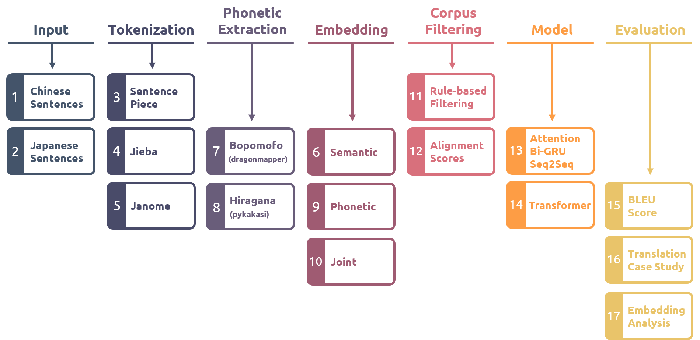

<h1 align="center">
  
</h1>

  <h4>Chinese-Japanese Neural Machine Translation with Semantic-Phonetic Embedding</h4>
 

Table of Contents

* [About](#about)
  * [Built With](#built-with)
* [Paper](#paper)
  * [Abstract](#abstract)
  * [My Poster](#my-poster)
  * [Full Document](#full-document)
  * [Oral Defense Slides](#oral-defense-slides)
* [Code](#code)
  * [Data Preprocessing](#data-preprocessing)
  * [Model, Training, Predicting](#model-training-predicting)
  * [Analyzing](#analyzing)
  * [Utility](#utility)
* [Additional Links](#additional-links)
* [Support](#support)
* [Authors & contributors](#authors--contributors)
* [License](#license)

---

## About

<table><tr><td>

This repository provides the code and details of my Master's thesis in Artificial Intelligence at National Cheng Kung University (NCKU). For more detailed information, please read the [abstract section](#abstract).

The TRUE COVER of this repository

 

</td></tr></table>

### Built With

* [HuggingFace tokenizers](https://github.com/huggingface/tokenizers)
* [SentencePiece](https://github.com/google/sentencepiece)
* [Jieba](https://github.com/fxsjy/jieba)
* [Janome](https://mocobeta.github.io/janome/en/)
* [Dragon Mapper](https://github.com/tsroten/dragonmapper)
* [Pykakasi](https://github.com/miurahr/pykakasi)
* [Gensim](https://radimrehurek.com/gensim/index.html)
* [PyTorch](https://pytorch.org/)
  * Attention-based Bi-GRU Encoder-Decoder Model
  * Transformer
* [PyTorch-Lightning](https://github.com/PyTorchLightning/pytorch-lightning)
* [WandB](https://wandb.ai/site)

## Paper

### Abstract

English Abstract

 
Neural machine translation has been improved by the introduction of encoder-decoder networks in recent years. However, the translation between Chinese and Japanese has not yet achieved the same high quality as that between English and other languages due to the lack of parallel corpora and less similarity in languages. This paper attempts to use phonetic information as an additional feature for Chinese and Japanese and aims to improve translation quality through feature engineering. We first extracted Chinese bopomofo and Japanese hiragana as phonetic information from the corpus with three tokenization approaches. Second, the embedding with semantics and embedding with phonetics are generated by training separately on the text and phonetic information. Third, we combined both embeddings to create a joint semantic-phonetic embedding and implemented it into two mainstream neural machine translation models for training and further extracting the features. The results show that the models trained and fine-tuned with joint embeddings yield higher BLEU scores than those using semantic or phonetic embeddings only. We also conducted case studies on the translation results. The translations generated with joint embeddings tend to select the correct and even more precise words and retain Japanese katakana and English words, resulting in semantic improvements. Besides, four analyses conducted on joint embeddings and semantic embeddings all gave positive feedback, which showed that the joint embeddings could preserve and even outperform the vector meanings possessed by the semantic embeddings. The reveal of BLEU scores and embedding analysis demonstrates that simply using a small corpus to extract phonetic information as a feature can positively affect the Chinese and Japanese word vectors. In addition, the use of joint semantic-phonetic embeddings can effectively improve the performance of Chinese-Japanese neural machine translation systems.

Chinese Abstract

 
近年來，神經機器翻譯因引入編碼器-解碼器網路而逐漸完善，但是在中文及日文的翻譯任務中，由於訓練資料的缺乏，以及和西方語言的差異性，始終無法獲得像英文與其他語言之間的高翻譯品質。本篇論文嘗試使用聲音資訊作為中日文的額外特徵，並將該特徵應用於中日文的神經機器翻譯系統當中，旨在透過以特徵工程的方式來加強翻譯品質。  
本論文基於三種分詞方法，在不同的分詞下，提取出語料庫中的中文注音以及日文平假名做為聲音資訊。接著，利用文字資訊以及聲音資訊，分別訓練出帶有語義以及帶有語音的詞嵌入；我們混合兩者，建立同時帶有語義及語音的「合併詞嵌入」，並將其投入至兩種主流的神經機器翻譯模型，進行訓練與進一步的特徵提取。  
實驗採用雙語評估替補分數 (BLEU) 對翻譯結果進行評分，結果表明，使用合併詞嵌入進行訓練與微調的模型，皆獲得比單純使用語義或語音的詞嵌入還要更高的分數。我們亦對模型的翻譯結果進行案例分析，由合併詞嵌入產生出的翻譯能夠保留正確，甚至更為精確的詞彙；也能夠保留片假名與英文術語，得到語義上的提升。實驗另外對合併詞嵌入和單純包含語義的詞嵌入進行四項分析，每項分析皆獲得正面回饋，顯示合併詞嵌入能夠保留，甚至超越語義詞嵌入所持有的向量涵義。  
綜合翻譯分數以及詞嵌入分析，我們發現單純使用小型語料庫提取語音資訊作為特徵，便能對中日文的詞向量帶來正面影響；此外，使用合併語義和語音的詞嵌入，能夠進一步有效提升中日文神經機器翻譯系統的效能。

### My Poster

You can view the poster I designed for this paper in [poster.pdf](documents/poster.pdf).

### Full Document

You can view my full paper in [thesis.pdf](documents/thesis.pdf).

### Oral Defense Slides

You can view my slides of oral defense in [oral_defense.pdf](documents/oral_defense.pdf).

## Code

### Data Preprocessing

- [Data Preprocess](experiments/main/data_preprocess/data_preprocess.ipynb)
- [Create Embeddings](experiments/main/data_preprocess/extract_embedding.ipynb)

### Model, Training, Predicting 

- [Attention-based Bi-GRU Model (w/o pretrained embedding)](experiments/main/nmt_task/rnn_baseline.ipynb)
- [Attention-based Bi-GRU Model (w/ pretrained embeddings)](experiments/main/nmt_task/rnn_embedding.ipynb)
- [Transformer (w/o pretrained embedding)](experiments/main/nmt_task/transformer_baseline.ipynb)
- [Transformer (w/ pretrained embeddings)](experiments/main/nmt_task/transformer_embedding.ipynb)

### Analyzing

- [Embedding Analysis](experiments/main/analyze/analyze_embedding.ipynb)

### Utility

- [Custom Tokenizer](experiments/main/utils/custom_tokenizer.py)
- [Step Checkpoint](experiments/main/utils/step_checkpoint.py)

## Additional Links

I have used [whimsical](https://whimsical.com/phonetics-machine-translation-7DLBJCEuDwpZd5Zvn8CpRq) to create a casual roadmap (mind map).

You can also go to [wandb](https://wandb.ai/windsuzu/phonetic-translation) to see all the parameters, loss, perplexity and BLEU Scores of the experiment.

## Support

Reach out to the maintainer at one of the following places:

- [GitHub issues](https://github.com/windsuzu/chinese-japanese-neural-machine-translation-with-semantic-phonetic-embedding/issues/new?assignees=&labels=question&title=support%3A+)
- The email which is located [in GitHub profile](https://github.com/windsuzu)

If you want to say **thank you** or/and support active development of Chinese-Japanese Neural Machine Translation with Semantic-Phonetic Embedding:

- Add a [GitHub Star](https://github.com/windsuzu/chinese-japanese-neural-machine-translation-with-semantic-phonetic-embedding) to the project.
- Write interesting articles about the project on [Dev.to](https://dev.to/), [Medium](https://medium.com/) or personal blog.

Together, we can make Chinese-Japanese Neural Machine Translation with Semantic-Phonetic Embedding **better**!

## Authors & contributors

The original setup of this repository is by [Shih-Chieh Wang](https://github.com/windsuzu).

For a full list of all authors and contributors, check [the contributor's page](https://github.com/windsuzu/chinese-japanese-neural-machine-translation-with-semantic-phonetic-embedding/contributors).

## License

This project is licensed under the **MIT license**.

See [LICENSE](LICENSE) for more information.