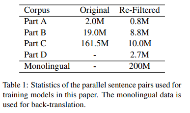
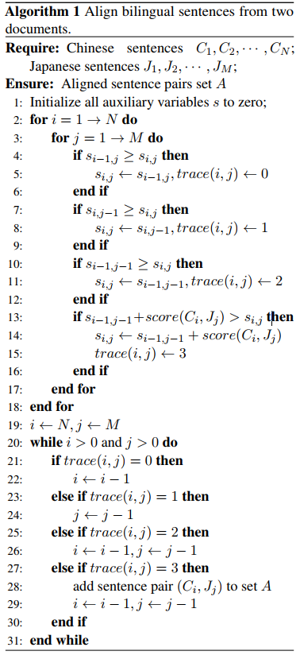
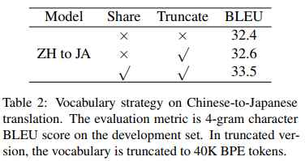
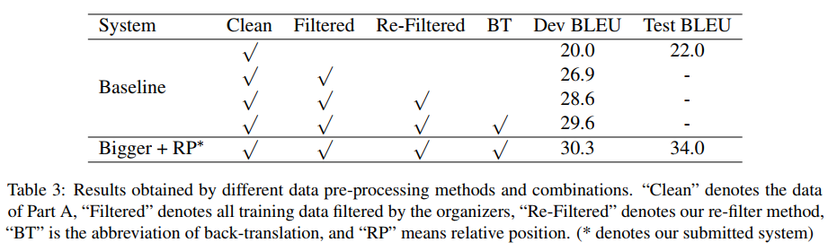

# LIT Team’s System Description for Japanese-Chinese Machine Translation Task in IWSLT 2020

## Abstract

這篇論文講解作者 (LIT Team) 參加 IWSLT2020 open domain translation task (Japanese-Chinese) 的經驗分享，他們以 baseline system 為基準，加強了:

1. `data-preprocessing`
2. `large-scale back-translation on monolingual corpus`
3. `shared and exclusive word embeddings`
4. `different granularity of tokens (sub-word level)`

## Introduction

論文使用最流行的 `encoder-decoder architecture` (特別是 `transformer`)，這種架構在 `rich resource corpus` 的幫助下表現特別好。論文中使用了最大的 transformer 架構，因為 transformer 依賴 model capacity (the number of dimensions of the feed-forward network)。

論文主要的貢獻為 `data pre-processing`，特別是 `parallel data filter` 和 `sentence alignment`，透過將訓練資料品質加強，就可以提升翻譯水準。

論文採用了 `back-translation` (Edunov et al., 2018)，將中文翻譯成日文，擴充了 `Japanese-Chinese training corpus` 的大小，是運用 `monolingual datasets` 的好方法。

最後引入了 `Relative Position Attention` (Shaw et al., 2018)，還比較了 `shared embeddings` 和 `exclusive embeddings` 是否有差；在 C-J 的方向中使用 `shared embeddings` 效果較好，而 J-C 方向的效果則相反。

## Dataset

Dataset 由 `Japanese-Chinese bidirectional machine translation competition (Ansari et al., 2020)` 而來，為主辦單位提供的大量但有 noise 的 Japanese-Chinese pairs，這些資料從網頁上抓取而來，主要分成四個部分:

1. 對已有的 `Japanese-Chinese parallel datasets` 進行清理，得到雖然小但乾淨的資料集
2. 主辦者透過對網路爬蟲資料，進一步 `align`, `filter` 所得到的 `pre-filtered dataset`
3. Unfiltered parallel web crawled corpus
4. Huge file of the unaligned scraped web pages with the document boundaries

在之後的方法中會介紹怎麼處理這四個部分，而論文團隊也有使用 `back-translation` 在額外的 `monolingual data` 增加資料數量 (data augmentation)。

## Method

### Data pre-processing

#### Parallel Data Filter

儘管提供的 dataset 已經有篩選過，但還是有許多 `mismatched sentence pairs`，論文根據以下規則做 `re-filter`:

1. 刪除 empty, duplicated sentences
2. 刪除 source, target 一樣的 pairs
3. 將所有中文轉成簡體
4. 刪除 source 和 target 之間沒有 `common Chinese character` (Chu et al., 2014) 的 pairs
5. 刪除英文和符號超過一半的 sentences
6. Maximum length ratio of sentence pairs = 1.8
7. 使用 fasttext 的 `language identification model` (Joulin et al., 2016b,a) 重新建構中文和日文句子

論文作者用手動調整的方式，得到上面所有的規則，將 Part A~D 的資料 (182.5 M) 縮減成 22.3 M 的 `parallel sentences`  資料集

#### Web Crawled Sentence Alignment

主辦方所提供的 Part D 為接近 15 M 的 `unaligned bilingual document pairs` 需要自己去對齊，論文作者提出了一種方法:

1. 將每個 sentence 當作一個 element
2. 使用 `longest common sub-sequence algorithm`
3. 找出擁有最高 `F1 similarity` 的 jp-zh sentence pairs
4. score(Ci, Jj) 表示透過 character overlap 所計算出來的 F1 value

可惜的是 Part D 部分有大量重複句子，最後只獲得了 2.7 M 的 sentence pairs

### Back-translation

論文作者從 Part D 取出 200 M 的中文句子作為 `monolingual data` 來實施 `back-translation` (Edunov et al., 2018)，為了用中文來產生 `synthetic bilingual corpus`，作者利用 `parallel data filter` 的 22.3 M 資料訓練了一個 `Chinese-to-Japanese transformer`。

另外在使用 `sharing BPE` 和 `truncating vocabulary size` 都能有效提升中翻日的 `transformer` 表現；實驗中的 `BPE merge operation` 次數為 30k，所以在 truncated 版本中，共有 40k 個 `BPE tokens`。

另外在 `back-translation` 中的 data 會加入 noise 讓表現更好:

1. 一個字會有 10% 被刪除
2. 一個字會有 10% 被 `placeholder token` 取代
3. 隨機換字的位子，但距離不超過 3 個字

### Model

論文會對 baseline 的 `transformer` 加入兩個小手段來增加表現:

1. Bigger Transformer
2. Relative Position Representation

#### Bigger Transformer

根據 Sun et al., 2019 實驗結果，增加 model capacity 能讓表現增加。所以作者將 `feed-forward dimension` 從 4096 增加到 8192，另外為了解決 `overfitting` 作者將 `relu dropout` 從 0.1 調到 0.3。 

#### Relative Position Representation

在 `self-attention` 中，通常都會使用 `absolute position information` 作為 `positional encoding` 的手段，但在最近的實驗中 (Shaw et al., 2018) 發現，使用 `relative position` 當作 feature 可以取得較好的表現。

#### Experiments

實驗使用 [tensor2tensor](https://github.com/tensorflow/tensor2tensor) 的 `transformer_relative_big`，只改動了 `feed-forward dimension` 和 `dropout`，每 1000 步存檔一次，將最後三個 `checkpoints` 平均起來獲得 `final model`。在 decoding 部分，最終是使用 `beam size = 6` 以及 `alpha = 0.8`，產生結果後將 `<UNK>` 刪除。

## Result

作者用固定的架構來測試不同的資料集，比較 `data processing` 的效果。隨著 data 增加，還有 data processing 的加強，甚至是最後對 model 增強，都有效提高分數。

