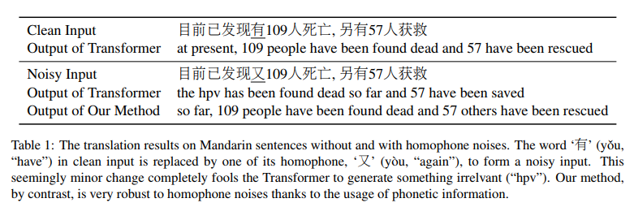
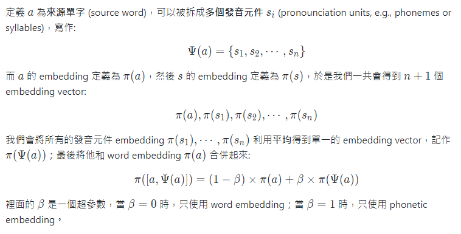
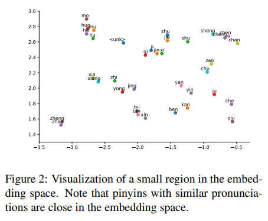
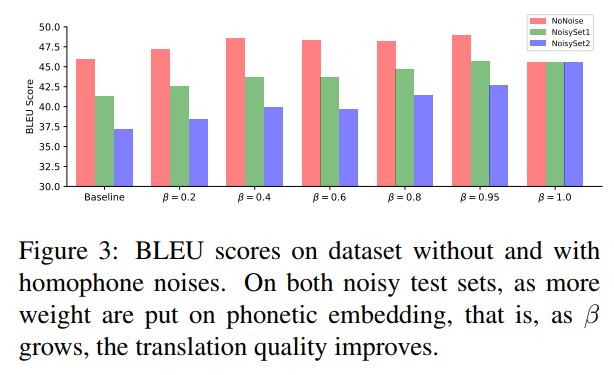
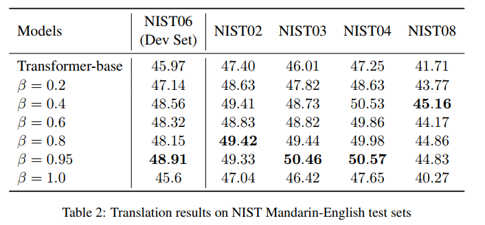
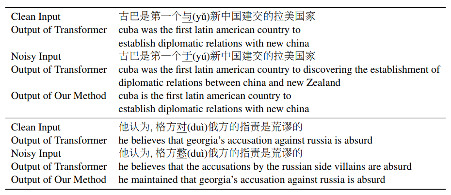

# Robust Neural Machine Translation with Joint Textual and Phonetic Embedding

Reference: https://arxiv.org/pdf/1810.06729.pdf

## Motivation

Neural machine translation (NMT) is notoriously sensitive to noises, but noises are almost inevitable in practice. One special kind
of noise is the homophone noise, where words are replaced by other words with similar pronunciations.

Despite tremendous success, NMT models are very sensitive to the noises in input sentences (Belinkov and Bisk, 2017).  It is very common for a user to accidentally choose a homophone instead of the correct word.

The transformer model can correctly translate the clean input sentence; however, when one Mandarin character, ‘有’, is replaced by one of its homophones, ‘又’, the transformer generates a strange and irrelevant translation. 

For homophone noises, since correct phonetic information exists, we can make use of it to make the output of the embedding layer
much more robust.

> 因為 embedding 可以視為網路中最早的輸入，所以錯字的 semantic embedding 將會直接帶偏整個神經網路的訓練。 而 phonetic embedding 恰好可以作為抗衡 semantic embedding 發生錯誤的特徵。
> - semantic 因錯字被帶偏
> - phonetic 不因錯字被帶偏

## Joint Embedding

定義 $a$ 為**來源單字** (source word)，可以被拆成**多個發音元件** $s_i$ (pronounciation units, e.g., phonemes or syllables)，寫作:

$$
\Psi(a) = \left\{ s_1, s_2, \cdots, s_n\right\}
$$

而 $a$ 的 embedding 定義為 $\pi(a)$，然後 $s$ 的 embedding 定義為 $\pi(s)$，於是我們一共會得到 $n+1$ 個 embedding vector:

$$
\pi(a), \pi(s_1), \pi(s_2), \cdots, \pi(s_n)
$$

我們會將所有的發音元件 embedding $\pi(s_1), \cdots, \pi(s_n)$ 利用**平均**得到單一的 embedding vector，記作 $\pi(\Psi(a))$；最後將他和 word embedding $\pi(a)$ 合併起來:

$$
\pi([a, \Psi(a)]) = (1- \beta) \times \pi(a) + \beta \times\pi(\Psi(a))
$$

裡面的 $\beta$ 是一個超參數，當 $\beta=0$ 時，只使用 word embedding；當 $\beta=1$ 時，只使用 phonetic embedding。

---

> Github 好讀版 👍
> 
> 

## Model

- Pytorch 0.4.0 OpenNMT
- 8 GPUs
- 6 layers
- 8 heads attention
- 2048 neurons in feed-forward layer
- 512 neurons in other layers
- dropout=0.1
- label smoothing 0.1
- Adam
- learning rate=2 with NOAM decay

## Observation

1. phonetic embedding 上相近的發音會聚集在一起

2. phonetic embedding 能有效提升 non-noise dataset，也能幫助 noisy dataset

3. beta=0.95 時效果最好，也就是 0.05 semantic embedding + 0.95 phonetic embedding

4. Case Study

## Related Work

1. Formiga and Fonollosa (2012) proposed to use a character-level translator to deal with misspelled words in the input sentences, but in general their method cannot deal with homophone noises effectively.
2. Cheng et al. (2018) proposed to use adversarial stability training to improve the robustness of NMT systems, but their method does not specifically target homophone noises and do not use phonetic information.
3. Li et al. (2018) also proposed to utilize both textual and phonetic information to improve the robustness of NMT systems, but their method is different with ours in how textual and phonetic information are combined.