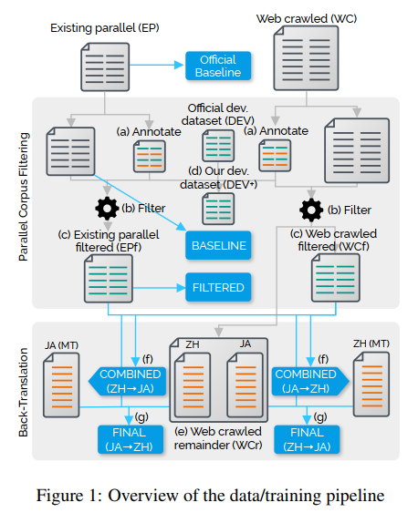
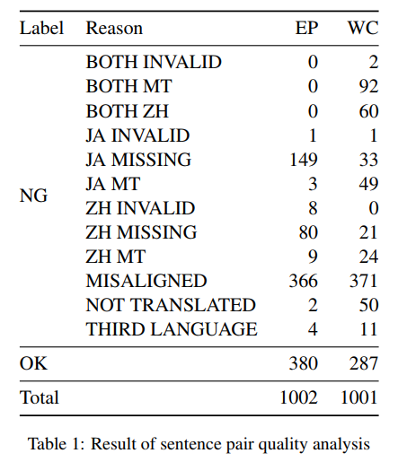
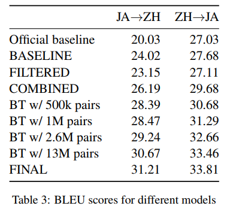
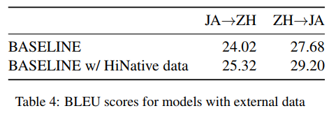

# Octanove Labs’ Japanese-Chinese Open Domain Translation System

## Abstract

這篇論文使用了兩種方法來提升 open domain 下的 `Japanese-Chinese translation system`:

1. Parallel corpus filtering
2. Back-translation

第一種方法使用一些 `heuristic rules` 和 `learned classifiers`，能將 parallel data 削減 70% 至 90%，而且不降低翻譯表現；第二種方法利用 `back-translation` 來產生人造資料，可以增加 17% 至 27% 的表現。

## Introduction

`IWSLT 2020 open domain translation challenge` (Ansari et al., 2020) 想呈現的問題，是現實中缺乏高品質、手動創造的 `parallel corpora`，但卻有很多從 web 爬蟲出來包含雜訊的 `noisy parallel data`。因為主辦方要求只能使用提供的資料，所以關鍵就在如何過濾 (filter) 並建立出最有用的資料。

使用摘要所說的兩種方法，然後採用基本的 transformer 當作 NMT 模型。

## Dataset

1. 首先使用 existing parallel (EP) dataset 包含公開的 `parallel sentences`
2. 再來使用 Web crawled (WC) dataset 包含從網路抓取 (crawling) 並對齊 (aligning) 及過濾 (filtering) 後的 `parallel sentences`

整個 data, training pipeline 的過程如下圖所示:

## Method

### Parallel Corpus Filtering

#### Sentence Pair Quality Analysis

這部分是 pipeline 圖中上半區塊的 (a)，作者發現就算是 EP 品質也不高，所以隨機提取 1000 個 pairs，然後讓兩位精通中日文的人對句子進行標註 (annotation)，標註句子是否為好的翻譯，如果不是則說明原因，標註方法用以下的 `tags`:

1. `INVALID`: 語意不佳、自然的詞彙較少
2. `MT`: 可能是用機器翻譯
3. `MISSING`: 某些資訊在某一邊遺失
4. `MISALIGNED`: 有資訊在兩邊都遺失，對不起來
5. `NOT TRANSLATED`: 兩邊句子一樣，可能只有些微不同 (e.g. 繁、簡體)
6. `THIRD LANGUAGE`: 句子由中日文以外的語言書寫

結果如下表所示，只有 38% (EP) 和 29% (WC) 是合適的資料集，其中問題較嚴重的是 `MISALIGNED`，可能是兩個句子皆由同樣來源而來，但切割方式出錯了。

#### Training Sentence Pair Classifiers

這部分是 pipeline 圖中上半區塊的 (b)，因為 `annotation` 的結果，所以作者決定使用 `heuristic rules` 及 `classifiers` 來排除品質不佳的 pairs，這方面的研究 (parallel corpus filtering) 可以參考 Koehn et al., 2018, 2019，這邊的 classifiers 由 `annotated data` 來學習。

`Heuristic rules` 列出以下幾個規則，違反下面規則的 pairs 就會被移除:

1. 兩邊都是 512 或更少的 Unicode characters
2. JA 或 ZH 的長度要為對方的 9 倍短 (LJA / LZH < 9) 和 (LZH / LJA < 9)
3. 句子需在 `NanigoNet` 的自動偵測下，判斷為中文或日文

`Classifier` 在 EP 和 WC 都各別訓練一個，使用三個特徵作為輸入，分別是:

1. log length of the Japanese text (in Unicode characters)
2. log length of the Chinese text (in Unicode characters)
3. cosine similarity between the sentence embeddings computed using the Universal Sentence Encoder (USE) (Cer et al., 2018)

過濾後，分別剩下原本 EP 的 31.9% 資料，和 WC 的 10.4% 資料，將他們分別命名為 `existing parallel filtered (EPf)` 和 `Web crawled filtered (ECf)`，可以在 pipeline (c) 看到。

|        | EP      | WC       |
| ------ | ------- | -------- |
| Before | 1963238 | 18966595 |
| After  | 627811  | 1973068  |

#### Development dataset

作者發現官方的 `development dataset (DEV)` 並不是 `open domain machine translation evaluation` 的最佳選擇，原因是這個資料集是從 [JEC Basic Sentence Data](http://nlp.ist.i.kyoto-u.ac.jp/EN/index.php?JEC%20Basic%20Sentence%20Data) 爬蟲後，人工翻譯所取得的 `paralle data`。

> Due to the way the the dataset is created (by first mining “typical” Japanese sentence structures from a large text corpus, then by translating these sentences to Chinese), it may not be well suited to evaluate ZH-to-JA MT systems.

所以作者將 annotation 為 OK 的 pairs 增加到 evalution 當中，使得 DEV 從 5304 提升到 5970 pairs，接下來所有實驗都是使用該 dataset 來驗證，這個 dataset 叫做 `DEV+hereafter` 在 pipeline (d) 可以看到。

### Back-Translation

確保資料集品質後，下個動作是想辦法增加有品質的資料集，一個方法是 `back-translation` (Sennrich et al., 2016; Edunov et al., 2018)，做法是先訓練一個 `target-to-source MT system` 將 target 的 `monolingual dataset` 翻譯回 source language，這些句子加入到 `source dataset` 再次訓練 `source-to-target MT system`。

我們使用 filtering 剩下的 (low-quality in parallel) dataset，這些被過濾的 pairs 被分別放入 `source side` (Japanese) 和 `target side` (Chinese) 然後做為 `monolingual dataset` 來使用，他們合在一起稱做 `Web crawled remainder (WCr)` 在 pipeline (e) 的部分可以看到。

首先作者先使用 EPf 和 WCf 來訓練 `ZH-to-JA NMT system` 和 `JA-to-ZH NMT system`，接著用這兩個 system 分別把 WCr 的 `target side` 翻譯回 `source side`，這個雙向過程在 pipeline (f) 的部分可以看到；在產生 `source side` 的時候使用 `top-k sampling` (versus beam search, Edunov et al. (2018))。

最終的結果為 pipeline (g)，由 EPf, WCf, WCr, back-translation data 一起訓練出來的兩個 `JA-to-ZH` 和 `ZH-to-JA` 的 transformer model。

### Model

以下為簡單的設定:

| 元件                              | 設定                                              |
| --------------------------------- | ------------------------------------------------- |
| NMT Model                         | vanilla Transformer (Vaswani et al., 2017)        |
| Floating point                    | fp16                                              |
| Objective                         | label smoothed cross entropy                      |
| Optimizer                         | Adam (beta1=0.9, beta2=0.997, eps=10e-9)          |
| Epoch                             | 40                                                |
| Beam size                         | 20                                                |
| Japanese and Chinese tokenization | SentencePiece library (Kudo and Richardson, 2018) |
| Evaluation                        | 4-gram BLEU (Papineni et al., 2002)               |
| Test word alignment (for <UNK>)   | fast_align (Dyer et al., 2013)                    |

以下為訓練參數，這些參數使用 EP 當作 dataset 然後由 20 次 `random parameter search` 所找出:

| 參數                                     | 值     |
| ---------------------------------------- | ------ |
| Size of SentencePiece vocabulary         | 10k    |
| Frequency threshold for including tokens | 3      |
| Number of encoder/decoder layers         | 6      |
| Embedding dimension                      | 1024   |
| Feedforward dimension                    | 8192   |
| Attention heads                          | 16     |
| Gradient clipping                        | 25.0   |
| Learning rate                            | 1e-4   |
| Warmup step                              | 16000  |
| Dropout                                  | 0.1    |
| Weight decay                             | 2.5e-4 |
| Label smoothing                          | 0.2    |
| Batch size in tokens                     | 6144   |

最終的 model 是由 6, 8, 10 層的 Transformers 做 ensemble 而成，且參數都是以上設置。

## Result

* `Official baseline`: 是沒有加入作者 development set (DEV) 時，官方測出來的 BLEU 分數
* `BASELINE`: 只用 EP 訓練的 baseline model
* `FILTERED`: 使用 EPf 訓練的 baseline model
* `COMBINED`: 使用 EPf 和 WCf 訓練的 model
* `BT`: 使用 EPf, WCf, WCr (各種大小) 及 back-translation 訓練的 model
* `FINAL`: 使用所有 WCr 和 ensemble 訓練

結果中 `FILTERED` 減少大量資料，但對分數影響不大；`BT` 使用越大的 `back-translation` 分數越高。這證明了 `parallel corpus filtering` 和 `back-translation` 在 JA-ZH NMT system 都是有效的。

## Discussion

### Negative Results

作者有做了其他努力，但都是以失敗結尾:

1. Filtering by provenance: 翻譯品質跟來源有關係，但用來源來分類並刪除句子時刪除過多，導致分數變差
2. Self-training: 透過 self-training 來從 WCr 自動產生 target-side，但沒有效果
   * [Self-training當道：對比Pre-training的優缺點](https://medium.com/%E8%BB%9F%E9%AB%94%E4%B9%8B%E5%BF%83/deep-learning-self-training%E7%95%B6%E9%81%93-%E5%B0%8D%E6%AF%94pre-training%E7%9A%84%E5%84%AA%E7%BC%BA%E9%BB%9E-4f1b5a937c5d)
3. Beam search: 使用 `beam search` 來產生 back-translation 的時候沒有效果，改用 `top-k sampling` 才有效果
4. Normalizing to Simplified Chinese: 把所有漢字都轉成簡體來一般化，反正造成反效果

### External Data

作者試著基於 IWSLT 2020 的資料，利用額外資料進行擴充訓練，例如使用了 [HiNative](https://hinative.com/) (一個 community-driven language learning QA service) 來收集裡面的 Japanese-Chinese question-answer pairs，收集方法採用如 `How do you say X in Japanese/Chinese`，因為是由網友自由回答，所以一樣有非常多 noise。

作者一樣訓練了一個 classifier (from EP & WC)，將 HiNative 資料集篩選至 80k sentence pairs，然後用基本的模型來測試:

雖然 80k 只是原資料 1.9M 的 4.2%，但卻提升了 5% 的 BLEU score，驗證了作者的 filtering 有效，且 HiNative 提供了原資料集沒有 cover 到的範圍 (perspectives, genres)。

未來可能會繼續加入更多的 external datasets (Ja-Zh) 例如 `JParaCrawl` (Morishita et al., 2019), `WikiMatrix` (Schwenk et al., 2019)
