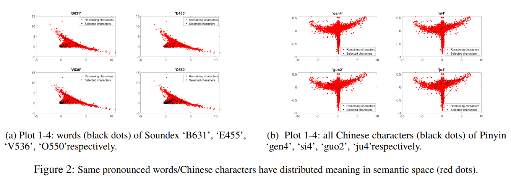
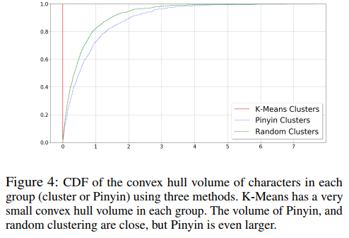
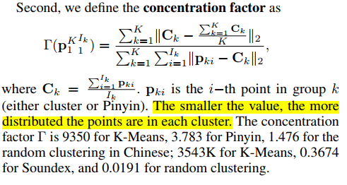
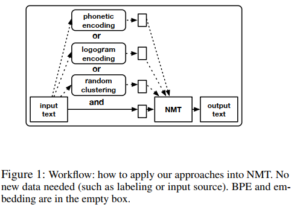
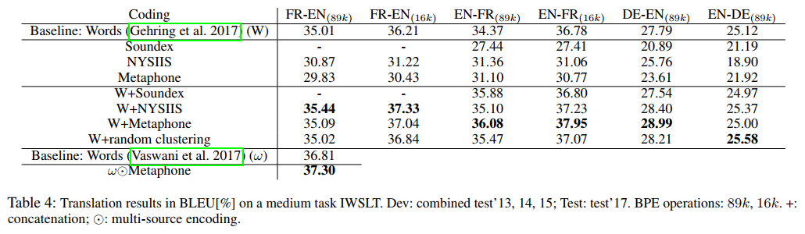

# Diversity by Phonetics and its Application in Neural Machine Translation

Reference: https://arxiv.org/abs/1911.04292

## Motivation

“Can we find a new representation of natural language data beyond the text that is less sensitive to styles or errors (without an additional input source)?”

## What is Phonetics?

Phonetics is another language representation (besides text).

1. Our first recourse, far earlier than any written language, was to encode our thoughts in sound (Blevins 2004)
2. Phonology, during human language development, carries semantic meanings, see (Tyler, Voice, and Moss 1996; Beaver et al. 2007). 
3. These studies coincide with neural discoveries about the correlation between phonology and semantics in the human brain (Wang et al. 2016; Amenta, Marelli, and Sulpizio 2017)

---

*What is phonetics?* A phonetic algorithm (encoding) is an algorithm for indexing words by their pronunciation.  We view these encodings as many-to-one functions that map multiple words to one (formally speaking it is a projection of the text)

| function | output | input                                |
| -------- | ------ | ------------------------------------ |
| Pinyin   | xiao4  | 笑, 校, 孝, 效                       |
|          | shi4   | 氏, 事, 市, 視                       |
| Soundex  | B300   | body, but bad                        |
|          | S120   | speak, space, suppose, speech        |
|          | C600   | car, care, chair, cherry, choir, cry |

We introduce `Soundex`, `NYSIIS`, `Metaphone` for Western languages, and use `Pinyin` for Chinese. 

## Hypothesis

**“One phonetic representation usually corresponds to characters/words that are semantically diverse.”**

Phonetics is a function that groups semantically different words. It seems plausible to think that part of the development of phonetics is that one re-uses the same sound when
context can be used to distinguish among multiple interpretations. For example, ‘to’ versus ‘two.’

> 同樣聲音的文字，會被用於不同的 context 來作區別，一方面也可以提升講話的順暢性。

## Observation

### Distribution Plotting

We can see that characters with the same pronunciation tend to have distributed meaning - that is, well-distributed over the Euclidean plane.

### Quantitative verifications

Empirical CDF of the convex hull volume of characters of each Pinyin, random clustering, and K-Means clustering (x-axes indicate the volume, and y-axes indicate the frequency.). Random clustering and Pinyin grouping have a larger volume than K-Means, respectively. 

For each group, Pinyin is slightly better distributed (more widespread) than uniformly random
clustering, and both of these are better distributed than KMeans. 

 
### Concentration factor

### Density Measure

Pinyin is the most well-distributed, then random clustering, followed by K-Means.

## How to use Phonetic embedding

We use (1) concatenation of phonetic and word sequences; (2) multi-source encoding of phonetics and text form in words.

We first apply phonetic encoding, logogram, or random clustering to the foreign sentences. Then we apply Byte-Pair-Encoding and learn a word embedding (marked as empty boxes)

Source and target embedding are trained jointly.

Finally, we concatenate or combine with multi-source encoder the embedding of the original text and the phonetics to feed into NMT.

## Result

## Related Work

1. (Hayes 1996; Johnson et al. 2015) applied phonological rules or constrains to tasks such as word segmentation.
2. The work of (Huang, Vogel, and Waibel 2004) used phonetic information to improve the named entity recognition task.
3. Bengio and Heigold (2014) integrates speech information into word embedding and subword unit models.
4. (Du and Way 2017) converted Chinese characters to subword units using Pinyin to reduce unknown words using a factor model.
5. polysemous word embedding structures by Arora et al. (2016)
6. factored models by Garc´ıa-Mart´ınez, Barrault, and Bougares (2016) and Sennrich and Haddow (2016)
7. feature compilation by Sennrich and Haddow (2016)
