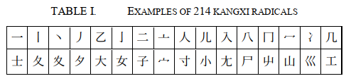
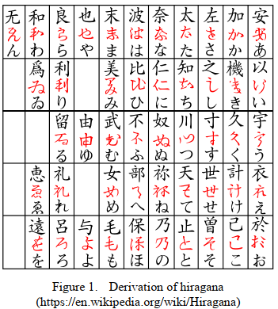
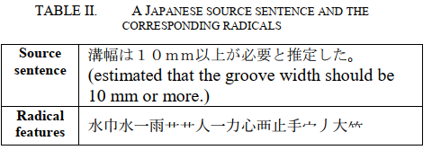
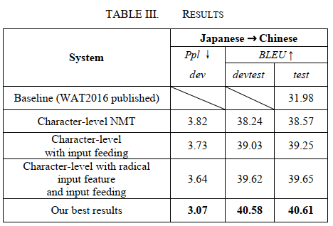
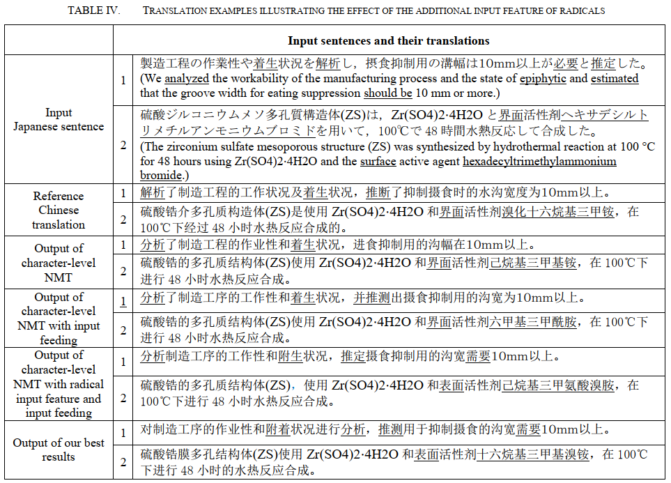

# Improving Character-level Japanese-Chinese Neural Machine Translation with Radicals as an Additional Input Feature

## Abstract

在 `word-level NMT` 有許多人加入額外的特徵取得更好效果，但還沒有人在 `character-level NMT` 加入過額外特徵。在這篇論文中，作者在 `character-level NMT` 中加入了中文字的部首 (**radical**) 作為額外特徵，有效提升了翻譯效果。

在 WAT2016 Japanese-Chinese scientific paper excerpt corpus (ASPEC-JC) 這個資料集上訓練，得到了兩個方面的進步:

1. Perplexity
2. BLEU

## Introduction

### Logogram problem

`Word-level NMT` 的最大缺陷是架構造成的 `vocabulary size` 限制，另外在一些語言中 (例如中文和日文) 要獲得 `uniformed correct word segmentation` 是較為困難的，因為這些語言的文字 (**words**) 在書寫上是無法分割的。

一個語言的 `character` 則比 `word` 數量要少，且被廣泛應用在不同領域中，展示出 `character-level` 的優勢。接著又出現了介於 `character` 和 `word` 之間的 `subword`，將一個 `word` 拆成多個 `characters` 組成。

但中文字、日文漢字等屬於 `logograms`，指的是文字即代表了某樣事物的意義，所以非常難將這類文字 (word) 拆成 subword。

### Feature selection

在 `word-level NMT` 的領域中，有許多人加入了額外的特徵來提升結果，例如 `POS tags`, `lemmas` 等，論文中認為 `radical` 也能作為 `character-level NMT` 的特徵，幫助增加效能。

在中文漢字當中，有 80% 以上都是音義複合 (`phono-semantic compounds`)，其中的 `semantic` 部分給予文字意義，而 `phonetic` 部分給予文字讀音。例如國字 **"鐵"** 的部首 (radical) **"釒"**，在日文中同樣也代表了 **metal** 的含義，在不包含上下文的情況下就已經提供了國字的意義。所以將部首 (radical) 作為 `finer grained semantic units` 的特徵一起訓練，或許能增加翻譯的表現。

### Baseline

這篇論文以 WAT2016 發表的系統當作比較對象 (baseline)，使用了 **encoder-decoder with attention** 做為基礎的架構，並改為 `character-level`。

* M.T. Luong, H. Pham, C. D. Manning, **“Effective approaches to attention-based neural machine translation,”** Proc. 2015 Conf. on Empirical Methods in Natural Language Processing, Lisbon, Portugal, 2015, pp. 1412−1421.

## Dataset

這篇論文的資料集使用用於 WAT2016 Japanese-to-Chinese translation subtask 的 **ASPEC-JC Japanese-Chinese corpus**。這個資料集的翻譯均為人工翻譯，將日文科學期刊轉為中文，內容從 `Japan Science and Technology Agency (JST)` 或 `Japan's Largest Electronic Journal Platform for Academic Societies (J-STAGE)` 截取而來，多為摘要 (abstract) 和一部分的內容 (body texts)，領域只包含了 “Medicine”, “Information”, “Biology”, “Environmentology”, “Chemistry”, “Materials”, “Agriculture” and “Energy”。

資料集分為四大部份:

1. training data (672315 sentence pairs)
2. development data (2090 sentence pairs)
3. development-test data (2148 sentence pairs)
4. test data (2107 sentence pairs)

* T. Nakazawa, M. Yaguchi, K. Uchimoto, M. Utiyama, E. Sumita, S. Kurohashi, and H. Isahara, **“Aspec: Asian scientific paper excerpt corpus,”** Proc. 10th Conf. on Int’l Language Resources and Evaluation (LREC2016), Portoroz, Slovenia, 2016, pp.2204?2208.

## Method

### Neural machine translation

The NMT system is implemented as a **global attentional encoder-decoder network** with **recurrent neural networks**, and we simply use it in **character-level**.

### Input features for Japanese characters

論文中使用了 214 個 **康熙部首 (Kangxi radicals)**，由部首的筆劃來排列 (stroke)。這些部首不但是國語字典的標準，也是許多計算機編碼的標準，例如 unicode 中的 `radical-stroke charts` 就是以康熙部首為標準製作。

日文的文字有三大系統: 漢字 (kanji), 平假名 (hiragana), 片假名 (katakana)

1. 漢字部首通常為 `graphemes` 或 `graphical` 元件，從 214 個康熙部首而來。
2. 平假名和片假名都沒有部首，但都是由漢字而來 (萬葉假名，manyogana)，我們將假名都轉回漢字，並取得漢字的部首作為特徵。

另外還有許多非中日文字會出現在句子當中，例如數字 (arabic numerals), 英文字母 (English alphabet), 特殊符號 (various symbols)，處理方法為下:

1. 數字 => 中文數字 => 部首
   1. 0 => 零 => 雨
   2. 1 => 一 => 一
   3. 9 => 九 => 乙
2. 英文 => 英 => 艸
3. 符號 => 符 => 竹

論文中使用 python 的 library `cjklib` 從漢字中拆出部首，拆出來的部首共 214 種作為額外特徵。以下是一個範例從日文句子截取出 `radical features` 來同時訓練:

### Model

整個網路架構如下:

1. LSTM model with 1 layer (512 cells)
2. Embedding size = 512
3. Parameters initialized in [-0.1, 0.1]
4. Plain SGD optimizer
5. Learning rate = 1
6. Mini-Batch size=10
7. Normalized gradient is rescaled whenever its norm exceeds 1
8. Dropout = 0.8
9. Beam size = 5
10. Input-feeding approach

為了讓 output 能用 BLEU 評分，會將 output 的句子用 `Jieba` 拆成文字。

## Result

### Metrics

不管是 perplexity 或是 BLEU 作為測量工具，在 `character-level NMT` 中加入了部首做為額外的特徵，可以幫助分數變好。

### Quality

在翻譯結果中，底線的為不同系統所翻譯出不同的詞，系統將 reference 沒翻譯到的 **"着生 (epiphytic)"** 也正確的翻譯成 **"附著"**；還有 **"必要 (should be)"** 也有正確的翻譯成 **"需要"**。另外在第二句中的 **"界面 (surface)"** 也有正確翻譯成 **"表面"**，這也是 reference 沒有翻譯出來的。

裡面的一大挑戰為 **ヘキサデシルトリメチルアンモニウムブロミド <=> 溴化十六烷基三甲銨** (hexadecyltrimethylammonium bromide)，沒有任何一個系統有翻譯出來，這連人類都很難做到。
