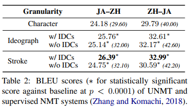
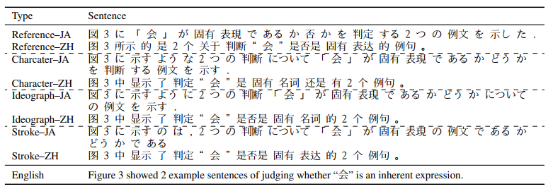

# Chinese–Japanese Unsupervised Neural Machine Translation Using Sub-character Level Information

## Abstract

Unsupervised neural machine translation (UNMT)

* 只需要相似語言的 `monolingual data`
* 可以產生不錯的 `bi-directional translation model`
* 但目前只用於 `alphabetic languages`
* 沒有人拿來用於 `logographic languages` (Chinese, Japanese, Korean)

這篇論文使用 UMNT 進行 Chinese-Japanese 翻譯，並將資料從 `character-level` 切成更細的 `sub-character level` (ideograph, stroke)

* Sub-charcter 贏過 character-level
* Stroke 贏過 ideograph system

## Introduction

Lample et al. (2018) 提出的 UNMT 只使用兩個 **"接近"** 的語言對，個別的 `monolingual data` 就可以訓練一個 `bi-directional translation model`，這個方法非常吃重兩個語言的 `shared information`。但實驗中是使用 `alphabetic language pairs` (English-French & English-German)，雖然 BLEU 成績不比 SOTA supervised 要好，但翻譯品質還不錯。

所以該實驗針對 `logographic writing system` 的中文和日文來訓練 UNMT，並且資料切成 `sub-character-level` 也就是 `stroke` 和 `ideograph` 看效果如何，以下是兩種語言 `character` 切成 `sub-character` 的範例，可以發現這兩種切法有蠻多 `shared parts` 對 BPE 和 shared vocabulary 都有幫助。

整個論文想探討的東西為:

1. UNMT 是否能在使用 `logographic language pairs` 的情況下有所表現，特別是資料切成 `sub-character-level` 之後
2. UNMT 的 `shared token rate` 有什麼影響?

## Datasets

* Asian Scientific Paper Excerpt Corpus (ASPEC-JC (Nakazawa et al., 2016)) 裡面的 Japanese–Chinese 資料集
* 是一個 parallel corpus 但將他們隨機洗牌作為 `monolingual data` 來使用
* 總共有 670000 個中文和日文句子
* 使用 2000+ 句子來測試
* 用 `Word level BLEU` 作為測量標準 (metric)

## Methods

### Shared BPE Embeddings

不採用 Artetxe et al., 2018 將兩個 `monolingual embeddings` 映射在同一空間，採用 Lample et al., 2018. 將兩種語言的 `monolingual data` 串起來，同時學習 shared BPE embedding，這種方法對 UNMT 比較有幫助。

### Encoder–Decoder Language Models

類似於 `Denoising autoencoder`，這個 `encoder-decoder language model` 首先會將 `monolingual data` encode 成 `latent representation`，接著再 decode 成相同語言，較深的 layers 會共享權重增加效能；有時可以加入 `MLP discriminator` 來辦別不同 encoders 的 `latent representation`。

### Back-Translation Models

使用了 Sennrich et al. (2016) 所提出的 `back-translation model`，同時聯合在雙向進行 `back-translation model` 的訓練，對一個方向來說，`forward NMT model` 先產生目標語言的翻譯，接著再用 `back-translation model` 來翻譯回原本語言。

### Chinese–Japanese Sub-character Level UNMT

#### Character Decomposition

中文和日文都透過 UNICODE 編碼，相似的 `CJK character` 會合併成同一種 type。[CHISE project](http://www.chise.org/) 提供方法將 CJK 資訊映射到 `predefined ideograph sequences`，總共有 394 ideographs 和 19 special symbols (用來代表 unclear ideographs)，另外還有 11 個 `Ideographic Description Characters (IDCs)` 描述 ideograph 之間的 `structural relationship`，用來降低模糊性。

基於上面這些資料，製作了一個叫做 `textprep` 的工具來幫助我們將 character 拆成 sub-character (ideograph, stroke) data，另外也產生了沒有 IDCs 的資料，用來比較結果。

#### Controlling Shared Tokens

在 Lample et al. (2018) 中 English–German 的 BPE tokens 有達到 95% 的分享率，在實驗中也試著調控 share ratio:

* token sharing rate `r`
* top-k value `k`
* sample size `N`

#### Baseline

Baseline 我們稱為 Character level baseline:

* UNMT system trained on Chinese–Japanese monolingual data
* pre-tokenized into words, and then `BPE’ed` using `fastBPE` (character-level)

#### Training parameters

用同樣的系統，但將 character 進一步切成 sub-character，作法是直接再分解成 character-level 然後再透過 `fastBPE` 執行 BPE 一次。另外我們也分別控制 sharing rate `r` 為 `0.5`, `0.7`, `0.9`。

再 pre-tokenization 的部分使用了 [Jieba](https://github.com/fxsjy/jieba) 來切割中文，使用 [MeCab](http://taku910.github.io/mecab/) 來切割日文成 IPA dictionary，而 BPE training 的字典大小設為 30000。

網路架構及參數為:

1. 4-layer standard Transformer (for both encoder, decoder)
2. Embedding size = 512
3. FCN hidden size = 2048
4. Encoder 最後三層參數共享
5. Multi-attention head = 8
6. Dropout = 0.1
7. Vocabularies and embeddings 是共享的
8. 10% of input and output sentence 會隨機反白，用於增加 noise
9. Adam optimizer with lr = 0.0001

## Results

### Sub-character

所有的 `sub-character` 在 UNMT 都得到比 `character-level` 要高的 BLEU 分數，另外 `stroke data` 在 UNMT 的表現比 `ideograph data` 來得好，這跟在 Zhang and Komachi (2018) 提出的 supervised NMT 是相反的結果。

### Different Token Sharing

| **r** | **JA-ZH** | **ZH-JA** |
| ----- | --------- | --------- |
| 0.5   | 19.72     | 25.23     |
| 0.7   | 23.60     | 28.32     |
| 0.9   | 23.04     | 28.84     |

Sharing rate 的確越高越好，值得一提的是在實驗中，只有 66-68% (比起 95%) 的 token 有共享，也能取得不錯的結果。

### Translation Quality

雖然整體的 BLEU 沒有一般的翻譯系統高分，但依然有不錯的翻譯表現，且有潛力被運用在更多領域。在翻譯結果中發現了較多的同義表現 (synonymous expressions) 這可能造成 BLEU 分數變低，但在母語人士的眼中是不錯的翻譯方法，這可能是來自 `encoder-decoder language models` 的功勞，成功抓到了特徵。目前還沒有一個 `semantic-based 的 metrics` 可以用來測量翻譯，否則 UNMT 的表現可以更好的表達出來。

> For example in Table 4, the characterlevel system’s Chinese translation “中 显示” was very close to the reference “所示” semantically, and was consistent in ideograph- and stroke-level models. A similar example would be “判断” in reference and “判定” in hypothesis.
