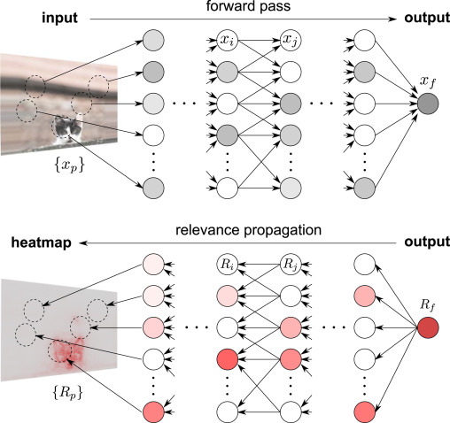

Deep Neural Models 的預測結果是非常難解釋的，因為其中牽涉了幾千個 neuron 和幾百萬個 parameters，因此要如何解釋神經網路是一個很大的研究領域，這個篇章介紹幾個 `interpretable deep learning` 的作法

# Post-hoc Interpretability

`Post-hoc interpretability` 的想法講白了就是將 model 當作 `black-box` 不去理解裡面的運作，但試著去解釋 input 和 prediction 的關係:

> “A trained model is given and our goal is to understand what the model predicts (e.g. categories) in terms what is readily interpretable (e.g. the input variables)”.

在 NMT 就是用 source tokens 來了解 target tokens

一個方法叫做 `layer-wise relevance propagation` (`On pixel-wise explanations for non-linear classifier decisions by layer-wise relevance propagation`) 利用 `heat-map` 來視覺化 input 中特別重要的資訊，例如:

1. Computer vision 中的 pixels
2. Machine Translation 中的 source words

目前有一些 post-hoc 用於 sequence-sequence model 上:

1. 透過搗亂 source sentence 來做出一個能夠找出 source-target 關係的模型
   * `A causal framework for explaining the predictions of black-box sequence-to-sequence models`
2. 透過將某個詞歸零，來比較歸零前後的預測分布，得出一種 `relevance score`
   * `An analysis of source context dependency in neural machine translation`
3. Post-hoc 分析在 NLP 的限制
   * `Pathologies of neural models make interpretations difficult`

# Model-intrinsic Interpretability

跟 `post-hoc` 不同，`model-intrinsic` 不把 NMT model 當作 `black-box` 而是試著解析裡面的 hidden neurons 或 layers 發生什麼事:

1. 視覺化 hidden layers 的 activities 或 gradients
   * `Visualizing and understanding recurrent networks`
   * `Visualizing and understanding neural models in NLP`
   * `Visualizing and understanding neural machine translation` 
2. 調查 encoder 最後一層的 hidden layer 來展示 NMT 在 `part-of-speech` 及 `morphological tags` 的能力
   *  `What do neural machine translation models learn about morphology?`
3. 利用 `regression analysis` 發現個別的 neurons 對特定 `linguistic properties` 的影響
   * `A toolkit for analyzing individual neurons in neural networks`
4. 甚至改變特定 neurons 的 activities 就能改寫整個翻譯的句子 (e.g., 句子中的性別)
   * `Identifying and controlling important neurons in neural machine translation`

其他的研究則是專注在 attention 機制上:

1. 提出 transformer 的 attention 在不同 attention layers 負責不同工作，並提出 NMT 並不是用 attention 來進行詞義消歧 (`word sense disambiguation`)
   * `An analysis of attention mechanisms: The case of word sense disambiguation in neural machine translation`
2. 分析 NMT 是如何用 attention 來處理 `source sentence`
   * `What does attention in neural machine translation pay attention to?`

# Confidence Estimation in Translation

計算 MT 的 `confidence scores` 不但能加強 MT 品質，也能增加 MT 的 `explainability` 和 `trustworthiness`

最常見的 `confidence score` 就是 model 分配給 token 或 sentence 的 `probabilities`，然而這在校正 (calibration) 較差的模型 (沒有根據真實分布來分配機率的模型)，就會不準確

另外由於 `confidence estimation` 已經在傳統 SMT 被玩膩了，所以這方面的研究較不起眼，目前能找到的只有利用 attention 來檢驗 word-level confidence 的 `Confidence through attention`

## Quality estimation

比 `confidence estimation` 在 NMT 有名的是 `quality estimation`，旨在找出比 BLEU 等方法更有意義的 `quality metric`，例如:

1. Estimating post-editing efficiency
   *  `Exploiting objective annotations for measuring translation post-editing effort`
2. Selecting sentences in the MT output which need human revision
   * `A method for measuring machine translation confidence`

# Word Alignment in Neural Machine Translation

> * 什麼是 word alignment?
>   * [Bitext word alignment](https://en.wikipedia.org/wiki/Bitext_word_alignment)
>   * [What is word alignment in the natural language processing domain?](https://www.quora.com/What-is-word-alignment-in-the-natural-language-processing-domain)

Word Alignment 是傳統 SMT 的核心之一，因為 SMT 中的 target 和 source phrases 都有很強烈的對應關係，所以 `word alignment` 可以視為翻譯結果的解釋

Word alignment 被公認是 MT 中很重要的工具:

1. 幫助強制限制輸出翻譯
2. 保證文字格式

但是 NMT 沒有這種 `hard word alignment` 的概念，你能想到的 `attention matrix` 在眾多的研究後也被證實和 `word alignment` 的效果有很大的差距: 

1. `Six challenges for neural machine translation`
   * Attention 並沒有每次都成功解釋 `word alignment`
2. `Attention is not Explanation`
   * Attention weights 多數情況都不會給出合理的翻譯解釋
3. `Is attention interpretable?`
   * Attention weights 只是中間層次的雜亂預測因子，不該做為決策原因
4. `Visualizing and understanding neural machine translation`
   * Attention 只能用來當作理解 source-target words 的對應關係，無法解釋模型
5. `What does attention in neural machine translation pay attention to?`
   * Attention 在名詞部分有成功的 `word alignment` 但在動詞就壞了
6. `On the validity of self-attention as explanation in transformer models`
   * Attention 視覺化會帶來誤導

目前將 `explicit word alignment` 引入 NMT 中還是一個新的領域，其中已有的貢獻為:

1. 將 `word alignment` 作為 attention model 的 `supervision signal`
   * `Supervised attentions for neural machine translation`
   * `Guided alignment training for topic-aware neural machine translation`
   * `Neural machine translation with supervised attention`
   * `Biasing attention-based recurrent neural networks using external alignment information`
2. 將傳統 SMT 的 `word alignment` 技術引入 NMT，例如 `fertility` 和 `agreement`
   * `Incorporating structural alignment biases into an attentional neural translation model`
   * Fertility, agreement: `The mathematics of statistical machine translation`

## Hard Attention

另外有個概念稱為 `hard attention` (`Neural image caption generation with visual attention`) 和 `hard word alignment` 最為相似，但主要用於 `simultaneous translation` 而不是 `offline translation`

以下是應用:

* Hard attention for speech recognition
  * `Learning hard alignments with variational inference`
* Hard attention for morphological inflection
  * `Morphological inflection generation with hard monotonic attention`
* Hard attention for text summarization
  * `Online and linear-time attention by enforcing monotonic alignments`
* Hard attention for image caption generation
  * `Neural image caption generation with visual attention`

以下是改良:

* Hybrid between soft and hard attention
  * `Coarse-to-fine question answering for long documents`
  * `Reinforced self-attention network`

## Alignment-based NMT

另一種方法是將額外的 `alignment models` 和 `lexical models` 引入 decoding 當中，希望在 decoding 過程中找出明確的 `alignment links`，目前做法有:

1. 在 `multi-head attention` 之上加入新的 `alignment head`
   * `On the alignment problem in multi-head attention-based neural machine translation`
2. 一樣在 `transformer` 上加入 `alignment layer`，但是是使用 `unsupervised` 的方式
   * `Adding interpretable attention to neural translation models improves word alignment`

