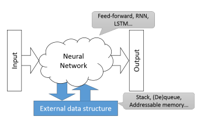

這章節講解其他替代的 NMT 架構方案

# Extensions to the Transformer Architecture

Transformer 已經成為幾乎所有 NLP 任務的標配，自然也產生了許多基於 `multi-head attention`, `self-attention`, `large-batch training` 以外的新架構，但都沒有得到亮眼成績

最值得注意的是 `Self-attention with relative position representations` 利用 `relative position` 取代掉 `absolute position`，但 relative 的方法會讓計算量變高，因為每一步時間點都要重新計算，解決方法有:

1. Attention masks 來縮小 attention 上下文範圍
   * `Hybrid self-attention network for machine translation`
2. 將 multi-head 的每個 attention head 加上 weights
   * `Weighted Transformer network for machine translation`
3. Star-Transformer 縮小了 inner-layer connections 來降低複雜度
   * `Star-Transformer`
4. 將 single deep encoder 換成了 multiple shallow encoder 來加速
   * `Parallel attention mechanisms in neural machine translation`

近期則是注重於 Transformer 在 `large scale language modelling` 的發展，另外也被用來作為 `contextualized word embedding` 的基礎，例如 `BERT`

# Advanced Attention Models

目前有使用 attention 的 NMT 模型，其 attention 計算方式可分為三大類:

1. Additive
2. Dot-product (scaled)
3. Multi-head attention

目前有很多研究嘗試提升這些方法的效能:

1. 在 attention layer 之上加入 memory 或 RNN 來持續追縱 `attention history`
   * `Neural machine translation with key-value memory-augmented attention`
   * `Neural machine translation with recurrent attention modeling`
   * `Implicit distortion and fertility models for attention-based encoder-decoder NMT model`
2. 建立新的 attention model 讓同一個值、不同維度的情況下學到不同的 `attention weights`
   * `Fine-grained attention mechanism for neural machine translation`

目前 attention-based NMT 有一缺陷是他們都是 `token-based`: attention output 是計算每個值的 `weighted average`，所以通常只專注在`單個 key-value pair`

這時就出現 `phrase-based NMT` 嘗試讓 attention 能夠一次專注於 `full phrases` 而不是 subwords, characters:

1. `Paying attention to multi-word expressions in neural machine translation`
2. `Chunk-based decoder for neural machine translation`
3. `Neural phrase-tophrase machine translation`
4. `Towards neural phrase-based machine translation`
5. `Neural machine translation with phrasal attention`
6. `Incorporating source-side phrase structures into neural machine translation`

另一方面，有時 attention 在處理較長句子時，反而會過度分散 attention，每個值反而變成其他值的噪音

目前的改善方法有:

1. `Hard attention` 能降噪，但只適用於 `monotonic alignment` 的問題
2. 設計一個 attention weights 的溫度計，用來控制 attention 的 `softness`
   * `Learning when to concentrate or divert attention: Selfadaptive attention temperature for neural machine translation`
3. 利用 `GRU gates` (取代 `weighted linear combinations`) 來計算值的 `attention output`
   * `A gru-gated attention model for neural machine translation`

# Memory-augmented Neural Networks

RNN 雖然在證明上為 `Turing-complete`，但在解決一些 sequence-to-sequence 問題上還是有問題，所以有很多研究在 RNN 之上加入了額外的 `memory structure`，例如:

1. stacks
2. queues
3. addressable memory cells
4. hierarchical memory structures

這些額外的 `memory structure` 不在網路中，而網路會學著跟 memory 透過 `PUSH` 或 `POP` 等簡單指令來交流，只是這些離散式的操作需要用連續 (continuous) 的近似來取代:

1. `Neural turing machines`
2. `Learning to transduce with unbounded memory`
3. `Inferring algorithmic patterns with stack-augmented recurrent nets`

# Beyond Encoder-decoder Networks

目前的 NMT 架構全部都是 encoder-decoder 的模式: 

* Encoder 負責從 source sentence 計算固定或變化長度的 `continuous hidden representation`
* Decoder 則負責從該 `representation` 抓出 target sentence 的機率分布

理所當然會出現一些研究想要改良 encoder-decoder 架構:

1. 用 `variational methods` 來定義 hidden representation 的分布 (`distribution`)
   1. `Variational neural machine translation`
   2. `Variational recurrent neural machine translation`
   3. `Modeling latent sentence structure in neural machine translation`
   4. `Generative neural machine translation`
2. `Non-autoregressive NMT` 被設計來移除或減少 decoder 的 `sequential dependency`，增加平行化
   1. `Semi-autoregressive neural machine translation`
   2. `Non-autoregressive neural machine translation`
   3. `Non-autoregressive neural machine translation with enhanced decoder input`
   4. `Non-autoregressive machine translation with auxiliary regularization`
   5. `End-to-end non-autoregressive neural machine translation with connectionist temporal classification`
   6. `Deterministic non-autoregressive neural sequence modeling by iterative refinement`
3. 在每個時間點重新計算 encoder state，將 hidden representation 擴張成 2D structure
   1. `Syntactically supervised Transformers for faster neural machine translation`
   2. `Towards two-dimensional sequence to sequence model in neural machine translation`
   3. `Can active memory replace attention?`
4. 不只將 last encoder layer 做為 hidden representation，而是將相同深度的 encoder 和 decoder 透過 attention 串接起來
   1. `Layer-wise coordination between encoder and decoder for neural machine translation`
