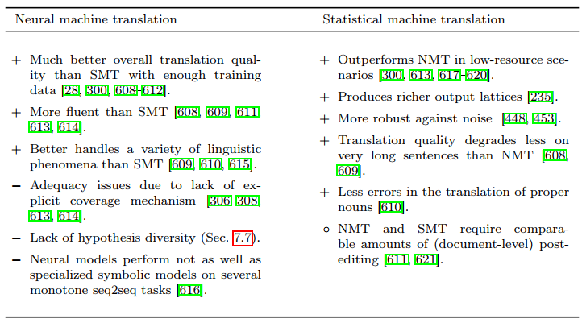

# NMT-SMT Hybrid Systems

在 NMT 還沒普及之前，`neural models` 通常作為 SMT 的特徵之一來訓練，而隨著 NMT 的發展，雖然 NMT 的表現已經比 SMT 還要優秀，但 SMT 依然能有部分的內容能與 NMT 互補:

所以融合 NMT-SMT 的系統也是一個研究方向，我們可以將融合方法分成 2 類:

## SMT-supported NMT

第一種方法沒有使用完整的 SMT，只借用了其 ideas 或 components 來解決 NMT 的一些問題，例如使用 NMT attention 模型的 `soft alignment weights` 來將 SMT 的 `symbolic SMT-style lexical translation tables` 引入到 NMT 的 decoder 當中

* `Lexicons and minimum risk training for neural machine translation`
* `Improved neural machine translation with SMT features`
* `Incorporating discrete translation lexicons into neural machine translation`
* `Bridging neural machine translation and bilingual dictionaries`
* `Neural machine translation with external phrase memory`

或是將 SMT 的 `word alignment models` 概念 (e.g., fertility, relative distortion) 應用到 NMT attention model 當中

* `The mathematics of statistical machine translation`
* `HMM-based word alignment in statistical translation`

## System Combination

第二種方法是將分開訓練完成的 SMT 和 NMT 系統合併起來，常見的合併方法是 `rescoring` 和 `reranking`，但可能因為 NMT 較為強大，所以效果較差:

* `Syntactically guided neural machine translation`
* `Neural lattice search for domain adaptation in machine translation`
* `Neural reranking improves subjective quality of machine translation`
* `Near human-level performance in grammatical error correction with hybrid machine translation`
* `Deeper machine translation and evaluation for German`
* `A smorgasbord of features to combine phrase-based and neural machine translation`
* `Improving neural machine translation through phrase-based forced decoding`

## Others

另外還有許多的方法來混合使用 NMT-SMT:

1. `Finite state transducer`: 基於 `based loose combination` 和 `edit distance loss` 來合併 NMT-SMT
   * `The edit distance transducer in action`
2. `The minimum Bayes risk (MBR)` 利用 n-grams 將 NMT decoder 導向至 SMT 的 search space
   * `MBR-based combination of NMT and SMT` has been used in WMT evaluation systems and in the industry
   * `Neural machine translation by minimising the Bayes-risk with respect to syntactic translation lattices`
3. 將 SMT 的結果作為 post-processing NMT system 的輸入，或是顛倒使用
   * `Pre-translation for neural machine translation`
   * `Neural system combination for machine translation`
   * `Neural pre-translation for hybrid machine translation`
4. 利用 SMT 的 `word recommendations` 來和 NMT 一起訓練，並且使用 `gating function` 來動態分配 NMT 和 SMT 之間的權重
   * `Neural machine translation advised by statistical machine translation`
   * `Incorporating statistical machine translation word knowledge into neural machine translation`
5. `AMU-UEDIN submission` (WMT16) 使用 SMT 為主，加入 NMT 作為 feature 來實現 `phrase-based MT`
   * `The AMU-UEDIN submission to the WMT16 news translation task: Attention-based NMT models as feature functions in phrase-based SMT`
6. 使用 NMT 來翻譯大部份的句子，而在 `post-processing` 使用 SMT 來翻譯 `technical terms`
   * `Translation of patent sentences with a large vocabulary of technical terms using neural machine translation`
7. `Hybrid search algorithm`: 在 NMT 的 decoder 中使用 SMT 提供的片語來擴大假設句子的數量 (hypotheses)
   * `Neural machine translation leveraging phrase-based models in a hybrid search`
8. 使用 SMT 作為 `unsupervised NMT` 的 regularizer
   * `Unsupervised neural machine translation with SMT as posterior regularization`
