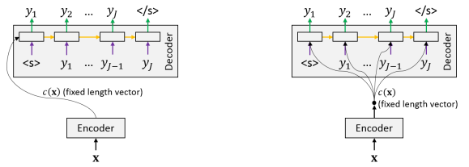
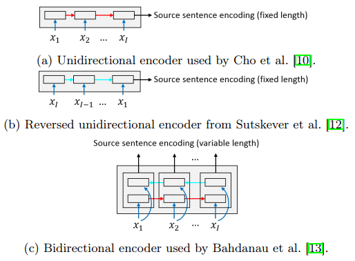
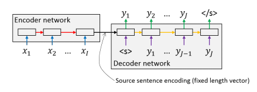

# Encoder-Decoder Networks with Fixed Length Sentence Encodings

## Origin

Encoder-Decoder 延伸自 `recurrent continuous translation models (RCTM I, RCTM II)`，是最流行的 NMT 模型

* Encoder 負責計算 source sentence 的向量
* Decoder 負責從 encoder 的資訊來產生 target sentence

## Method

在大部份 NMT 模型中，要得到 target sentence (y) 通常是用 source sentence (x) 來計算 ) 的機率

 \stackrel{\text{Chain rule}}{=} \prod_{j=1}^J P(y_j\mid y_1^{j-1}, x))

不同的 encoder-decoder 對 ) 做不同處理，例如

=g(y_j\mid s_j, y_{j-1}, c(x)))

* ) 是一個 feed-forward network 最後一層為 softmax
* ) 的 input 是
  * ) 代表 source sentence 的 vector
  *  代表 decoder 的 hidden state
  *  代表已產生的前 j-1 個 tokens

Source sentence ()) 有兩種用法: 

1. 只用來初始化第一個 decoder state 
2. 用在 decoder 的每一個時間點

## Models

LSTM, GRU 通常會被使用來避免 vanishing gradient problem

* 但也可能使用 stacked LSTM
  * `Sequence to sequence learning with neural networks`
* 也有人使用 CNN 取代 Encoder 中的 LSTM, GRU

將 source sentence 丟進 encoder 的方式也有很多種

1. 將 token 用一般語言的排序丟入 (Unidirectional)
   * `Learning phrase representations using RNN encoder–decoder for statistical machine translation`
2. 將 token 用相反的排序丟入 (Reversed unidirectional)
   * `Sequence to sequence learning with neural network`
3. Bidirectional RNN 可以一次讀到上面兩種結果
   * `Bidirectional recurrent neural networks`

## Process

當 source sentence 被完整 encoded 之後，decoder 就會開始產生 target sentence 的 `y1`，`y1` 會回到 decoder network 的起點，一起產生 `y2`

整個算法會在 decoder 產生 end-of-sentence 的符號時 `</s>` 停止

## 補充

https://easyai.tech/ai-definition/encoder-decoder-seq2seq

* 只要是輸入序列、輸出序列就是 seq2seq
* seq2seq 算是 Encoder-Decoder 的一種
* 簡單的 attention 介紹

https://blog.csdn.net/u014595019/article/details/52826423

* Encoder-Decoder 的不足
* Attention 補足