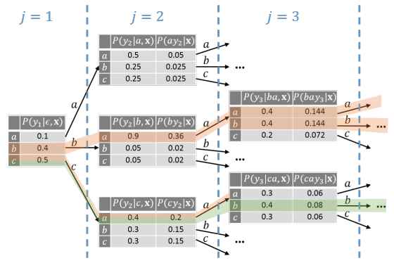
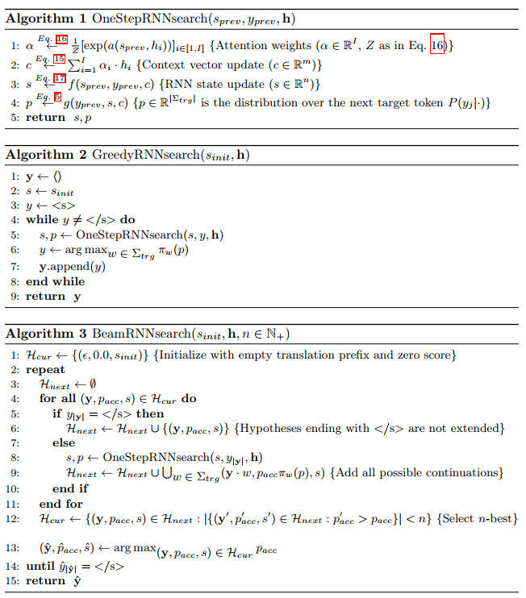
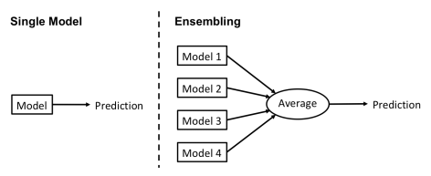
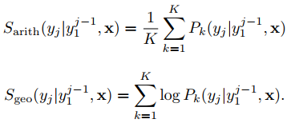
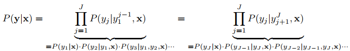

# The Search Problem in NMT

NMT 要計算的  (translation probability) 需要給定 `x` 和 `y`，但實作中並不會知道 y，得出這個 y 可說是機器翻譯的最終目標

利用 source sentence `x` 來求出最接近的  的這個任務叫做 **decoding** 或是 **inference**

NMT decoding 有兩大重點:

1. Search space 隨著字典大小增加而指數成長
   * 例如當字典大小為 32000 時 
   * 要翻譯出 20 個字的時候，就需要在 32000^20 個可能性中搜尋 (大於宇宙中的原子 10^82)

2. NMT 模型犯錯是時常的事情，Search 越深反而會產生較差的翻譯
   * `On NMT search errors and model errors: Cat got your tongue?`

# Greedy and Beam Search

NMT 最常用的 decoding 演算法是 `greedy search` 和 `beam search`

翻譯永遠是從左到右，隨著評分  來進行翻譯，也就是說翻譯都是與時間同步的 (time-synchronous)

## Greedy Search (Green)

Greedy search 會在每一個 time step 選取最好的 (綠色線所示)

* j=1 時選取 `c`
* j=2 時選取 `a`
* j=3 時選取 `b`

Greedy search 的最大問題是 `garden-path problem` (`P. Koehn, Neural machine translation`)

若是在 j=1 選的 `c` 是錯誤的，那麼後面選擇的單字就會整組壞掉

## Beam Search (Orange)

Beam search 就是為了緩解 greedy search 的問題而出現的，每次會選取 `n` 個分數最好的 `translation prefix`

例如上圖就是以 n=2 下去找出最好的翻譯，被選到的 n 個當前最好的前綴句子稱為 `active hypotheses`

儘管 beam search 看起來已經解決了 greedy search 的缺點，但事實上依然存在 `garden-path problem` (`On NMT search errors and model errors: Cat got your tongue?`)

## Mathematical Description of Decoding for the RNNsearch Model

# Ensembling

Ensembling 使用 `K` 個 NMT network (可以獨立訓練、或彼此分享權重) 並在 decoder 使用 `arithmetic` 或 `geometric` average 來預測

1. `S_arith` 依然會很合理的將 `y` 的預測分布加總至一
2. `S_geo` 則是改用 log-probabilities 讓計算更加穩定，在合併時不用先轉換成機率

最先進的 NMT system 都有使用 ensembling，而最有名的是 *Tencent* 使用了 72 個 translation models (`Tencent neural machine translation systems for WMT18`)

但 Ensembling 有一些缺點：

1. Decoding 速度變得非常慢 (因為要一次處理 K 個模型，且 softmax 非常昂貴)
2. Ensembling 可能要頻繁在 CPU/GPU 切換，因為計算平均可能需要在 CPU 進行
3. Ensembling 比單一 NMT system 還要難實作

在 [13. Model size](../13.%20model-size/README.md) 章節會講到 `knowledge distillation` 可以用於減緩 ensembling 的缺點

## Ensembling details

通常在 ensembling 的所有 model 都是使用相同 `size` 和相同的 `training data`，只有隨機 `weight initialization` 和隨機 `order of training samples`

常見的說法是 ensembling 的每個 model 會犯不同的錯，但最終又可以被其他 model 中和掉 (`Ensemble-based classifiers`)，這聽起來很合理，因為 NMT 的翻譯品質在每次訓練都會差距很大 (`Neural machine translation of rare words with subword units`)

NMT 的 loss surface 往往是 `highly non-convex` 的形狀，所以無法到達 local optima，而 ensembling 可以緩解這個問題，甚至能達到 regularization

## Checkpoint Averaging

`Checkpoint averaging` 常和 ensembling 一起討論，`checkpoint averaging` 會追蹤訓練時的 checkpoint 定期將 `weight matrices` 平均然後作為最終矩陣，且不增加 decoding 時間，在 NMT 常被使用 

* `Advances in Neural Information Processing Systems`
* `The University of Cambridge’s machine translation systems for WMT18`
* `Training tips for the Transformer model, The Prague Bulletin of Mathematical Linguistics`

和 ensembling 處理不同的問題，主要是修正 `training curve` 的 `minor fluctuation`

`Minor fluctuation` 的造成原因通常是:

1. optimizer's update rule
2. mini-batch training 下 gradient estimation 的 noise

因為個別獨立的 model 相差很大，`checkpoint averaing` 無法用在 independently trained models

# Decoding Direction

其實 decoding 不管是由左至右 (L2R) 或是相反 (R2L) 在數學意義上其實是一樣的

但當 L2R 和 R2L 互相組合後，可以得到更好結果:

* `The University of Cambridge’s machine translation systems for WMT18`
* `Edinburgh neural machine translation systems for WMT 16`
* `Sogou neural machine translation systems for WMT17`
* `Tencent neural machine translation systems for WMT18`

組合方法通常是使用 `rescoring`: Strong L2R ensemble 模型先建立 `n-best list` 然後再使用 R2L 模型來重新算出 (rescore) 最好的結果

* 可以使用 minimum Bayes risk framework 作為 R2L 模型
  * `The University of Cambridge’s machine translation systems for WMT18`
* L2R 跟 R2L 可以分開訓練，也可以同時訓練
  * 同時訓練可以將一方做為另一方的 `regularizer`
  * `Regularizing neural machine translation by target-bidirectional agreement`
  * `Regularizing forward and backward decoding to improve neural machine translation`
* 除了 L2R 和 R2L 還有很多種方法:
  * middle-out
  * top-down in a binary tree
  * insertion based
  * source sentence order

## Enhanced neural machine translation by learning from draft

另一個讓 decoder 理解目標句子的 context 的方法有兩步驟:

1. 首先先隨意翻譯 (打草稿) 生出一個 `draft translation`
2. 使用 `multi-source NMT system` 利用 `source sentence` 和 `draft` 來產生最終翻譯

關於草稿的做法，還有很多變形方式:

1. Similar scheme but generated the draft translations in **reverse order**
   * `Asynchronous bidirectional decoding for neural machine translation`
2. **Reinforcement learning** to choose the best number of decoding passes
   * `Decoding with value networks for neural machine translation`

# Efficiency

如何增加 NMT decoding 效率還是一個研究的方向，因為 L2R 等 beam search 的方式非常難實作平行化，目前有實作的:

1. 平行計算多個 timesteps 然後再驗證 translation prefixes
   * `Blockwise parallel decoding for deep autoregressive models`
2. 平行的將 target sentence 預測成另一種 `latent discrete variables` 再將他轉成最終翻譯
   * `Fast decoding in sequence models using discrete latent variables`
3. 調整 recurrent NMT 當中的 recurrent units 變得更簡單
   * `Deep neural machine translation with weakly-recurrent units`
4. 將 SMT 的 `hypothesis recombination` 引入 NMT 當中
   * `Statistical Machine Translation`

還有一些更簡單的方法，例如根據 timesteps 來調整或縮小 beam size

1. NMT training loss 根據 beam search 來懲罰
   * `Sequence-to-sequence learning as beam-search optimization`
2. 在 [13. Model size](../13.%20model-size/README.md) 提到的 Knowledge distillation **大幅**減少 greedy 和 beam search 的差異
   * `Sequence-level knowledge distillation`

# Generating Diverse Translations

Beam search 有一個大問題，就是每次產生的不同句子差異都只有一兩個字，缺乏多樣性 (diversity)

這樣的問題有三個:

1. 自然語言具有高度的模糊性 (ambuguity)，無法用 n-best list 輕易的代表
2. 無法提供用戶需要時的替代翻譯
3. Collecting statistics about the search space is much less effective
   * estimating the probabilities of n-grams for minimum Bayes-risk decoding
   * risk-based training

有一些人提出了解決辦法:

1. 在 decoder 的 hidden layer activation 加入 `noise` 產生其他高分的替代句子
   * `Noisy parallel approximate decoding for conditional recurrent language model`
2. 修改 beam search 的 objective function 添加 `maximum mutual information criterion` 來懲罰相同 parent node 的句子
   * `A diversity-promoting objective function for neural conversation models`
3. 將 `active hypotheses` (候選句子) 分群，並用 dissimilarity 技巧來確保多樣性
   * `Diverse beam search: Decoding diverse solutions from neural sequence models`
4. 用 k-nearest neighbor 從 greedy translation 結果找出替代句子
   * `An effective diverse decoding scheme for robust synonymous sentence translation`

# Simultaneous Translation

大部分的翻譯系統都是 offline 的系統: 得到完整的 source sentence 才開始翻譯成 target sentence 

但在現實中有很多需求是 real-time speech-to-speech translation (e.g., 演講翻譯、語音服務)，除了要能翻的好，還要能達到 `low latency`

為了達到 `low latency` 勢必要在得到 full source sentence 之前，就開始翻譯，這種問題稱為 `source sentence segmentation problem`

1. Source sentence 每個時間點只出現一個單字
2. 滿足指定的單字數量以及制訂的 `segmentation policy`，就進行一次翻譯
3. 重複直到整個句子翻譯完成

Segmentation policy 可以是 heuristic 也可以是用 RL 學出來的:

* `Can neural machine translation do simultaneous translation?`
* `Don’t until the final verb wait: Reinforcement learning for simultaneous machine translation`
* `Learning to translate in real-time with neural machine translation`

翻譯的 NMT system 通常是訓練 full sentence 翻譯而來，這會有兩項缺點:

1. Training 和 testing 的差距過大
   * 有人透過在 training 中加入 fixed maximum latency 來解決
   * `Simultaneous translation with integrated anticipation and controllable latency`
2. 人類在即時口譯的專業中使用了一些"複雜的技巧"，例如改變語法結構來減少 latency
   * 這些策略難以使用 NMT system 達成
   * 這類訓練資料 (human simultaneous translators) 也非常稀少
