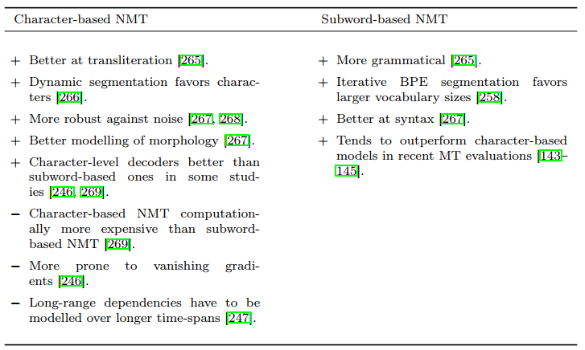

# Using Large Output Vocabularies

單字的數量 => 影響 Embedding 大小 => 讓 model 膨脹，影響整個 model 的效能

大的 model 需要用`小的 batch size`，因為需要分配 GPU memory，但這會導致:

* Noisier gradients
* Slower training
* Large softmax output layer is very expensive
* Worse model performance

另外單字的 long-tail distribution 會讓實作變得困難，例如在 English-German WMT18 training set (140M words) 當中:

* 875K 個英文單字中的 843K (96.5%) 在資料集中只出現 100 次以下
* 代表 96.5% 的單字在整個資料中只出現了 `0.00007%` 

常見的解決方法是使用 `word-based NMT model`

* 限制字典大小為 `n`
* 剩餘的單字都改用 `<UNK>` 等 token 表示

缺點是:

1. 產生的翻譯可能出現 `<UNK>`
2. Out-Of-Vocabulary (OOV) 機率約為 3%
   * 35 個字就會出現一個 `<UNK>` 
3. `<UNK>` 有時太多會造成平衡問題，讓模型偏好輸出 `<UNK>`

要緩解 `<UNK>` 造成的影響有兩種方向: `translation-specific` 和 `model-specific`

## Translation-specific Approaches

這類方法保留長度為 n 的字典，然後針對 UNK token 做修正

1. 追蹤 `<UNK>` 在原始句子的位置，並利用訓練好的 `bilingual word-level dictionary` 來直接翻譯 `<UNK>`
   * `Addressing the rare word problem in neural machine translation`
   * `Neural machine translation systems with rare word processing`
   * 治標不治本，看字典方法不是好的翻譯方式
2. 將所有 OOV 單字使用相似的單字取代 (cosine similarity)
   * `Towards zero unknown word in neural machine translation`
   * 沒辦法 cover 到所有 OOV 單字
   * 取代的可能反而是差別很大的單字

> All share the inevitable limitation of all translation-specific approaches, namely that the translation model itself is indiscriminative between a large number of OOVs.

## Model-specific Approaches

直接改變 model 讓他可以和大型字典一起訓練

1. 新增 `lexical translation model` 到 NMT 當中，直接連接 source 和 target words
   * `Improving lexical choice in neural machine translation`
2. 取消使用 full softmax 來預測單字
   * `When and why are log-linear models self-normalizing?`
3. Noise-contrastive estimation (NCE) 訓練一個 logistic regression model 分辨真實訓練資料或是噪音
   * `Learning word embeddings efficiently with noise-contrastive estimation`
   * `A fast and simple algorithm for training neural probabilistic language models`
4. Vocabulary selection 利用 vocabulary 的 subset 來近似出 full softmax 的結果，subset 的選法有很多種 (e.g., important sampling)
   * `On using very large target vocabulary for neural machine translation`

> * Both softmax sampling and UNK replace have been used in one of the winning systems at the WMT’15 evaluation on English-German.
> * `Montreal neural machine translation systems for WMT’15`

## Word-based NMT problem

不管 translation-specific 還是 model-specific 再怎麼改進，word-based NMT 本身就有缺點:

1. translation-specific 利用 `<UNK>` 取代生詞，但大量生詞得到相同分數
2. model-specific 無法對稀有的生詞建立出一個很好的 embedding

透過 word-based 且大量 vocabulary 訓練的 NMT 無法輕易的增加新詞彙的認知，但是在商業等級的 MT 系統又必須要客製化在特定 domain 當中，並且一些生詞是不需要被翻譯的

# Character-based NMT

一些新方法將單字拆成更小的單位 (finer-grained units)，然後用這些單位直接訓練模型翻譯

第一個實現的論文為 `Character-based neural machine translation`

1. 核心的 NMT network 還是保留在 word-level
2. 用 subnetworks 來取代輸入輸出的 embedding layer
   * 這些 subnetworks 從文字中的 character 來計算文字的 word representation
   * 這些 subnetworks 可以是 recurrent, convolutional, hybrid

實作的論文有:

* recurrent
  * `Neural machine translation with characters and hierarchical encoding`
* convolutional
  * `Character-aware neural language models`
* hybrid
  * `Achieving open vocabulary neural machine translation with hybrid word-character models`

Character-based model 依然有 `segmentation dependent` 的問題存在

1. Input text 必須使用 tokenizer 進行預處理
2. 在語義豐富的語言中需要看情況使用 `compound or morpheme splitting`
3. 或者排除標點符號 (punctuation symbols)

由於 tokenization 非常容易出錯並降低整體表現，所以很多人嘗試打造不需要 `prior segmentation` 的 character-level system

1. Bi-scale recurrent neural network 取代 segmentation
   * `A character-level decoder without explicit segmentation for neu- ral machine translation`
2. Convolution 移除 segmentation
   * `Fully character-level neural machine translation without explicit segmentation`
3. Bytes-level system
   * `Byte-based neural machine translation`
4. Planning mechanism 幫助提升 attention weights
   * `Character-level neural machine translation with planning`

# Subword-unit-based NMT

介於 full word 和 character 之間的 subword-level 是目前在 NMT 中最常見的單位，從文字中抽取 subword 的方式有:

1. Huffman-codes
   * `Variable-length word encodings for neural translation models`
2. Word-piece models
   * `Japanese and korean voice search`
3. Byte pair encoding (BPE)
   * `A new algorithm for data compression`

Byte pair encoding (BPE) 的作法如下: 

1. 先從 character set 抓出 subword units set
2. 遞迴使用 subsequent merge operations 擴大 subword units set
   1. 將 text 中 co-occurrences 最高的兩個 units 合併
3. 至 vocabulary size 夠大時停止遞迴
   1. Size 為手動制定，或依照資料大小制定

> * 線上資源:
> * [Byte pair encoding](https://en.wikipedia.org/wiki/Byte_pair_encoding)
> * [深入理解 NLP Subword 算法：BPE、WordPiece、ULM](https://zhuanlan.zhihu.com/p/86965595)

給定 BPE vocabulary 後，在切割文字 (segmentation) 時會出現很多不同的拆法，大多的 BPE 實作都是採用貪婪選擇最長的 subword units

Segmentation 也會依照對 subword 的限制 (constraints) 有所不同，最常見的限制是 subword 不能橫跨多個字，然而要實作這些限制，需要使用 tokenizer 容易產生潛在的 errors

# Words, Subwords, or Characters?

目前 word, subword, character 還沒有一個結論誰最適合做為 training units，而 character-based 似乎比 subword-based NMT 還要好，但比較難實作: 

在傳統 SMT 的研究中 translation units 反而是越來越大的趨勢:

1. Word-based IBM models
   * `The mathematics of statistical machine translation`
2. Phrase-based MT
   * `Statistical Machine Translation`
3. Hierarchical SMT
   * `Hierarchical phrase-based translation`

而 character, subword-based 的想法則是將字越取越小，想要抓到文字的真正含義 (meaning)，因為翻譯其實就是在兩種語言間傳遞 meaning

補充一下，有一說法是 character, subword-based 源自於 `language's writing system`，而大多數的手寫系統並不是 `logographic` 而是 `alphabetic` 或 `syllabaric`

所以圖形 (symbols) 是沒有任何含義的，在 [NMT-SMT 混合系統](../15.%20nmt-smt-hybrid/README.md) 中才加入了 `symbolic word-level or phrase-level` 的資訊給 NMT

> * [Logogram - 語素文字](https://en.wikipedia.org/wiki/Logogram)
> * [Phonogram - 表音文字](https://en.wikipedia.org/wiki/Phonogram_(linguistics))
> * [Syllabary - 音節文字](https://en.wikipedia.org/wiki/Syllabary)
