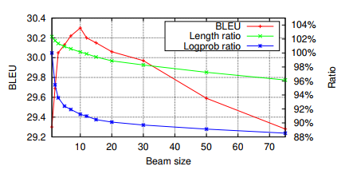
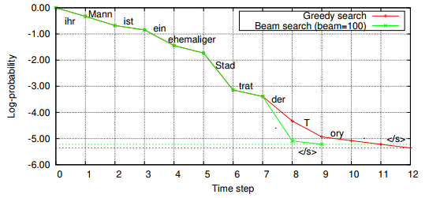

# NMT Model Errors

NMT 能比 SMT 更有效的對翻譯結果 assign scores (probs)，因為他在 decode 時不做任何 `conditional independence assumption`

NMT 只能用 beam search 這類簡單搜尋方法，不能使用複雜的搜尋技巧。所以 NMT translation 的 `search errors` 多過於 `model errors`

1. `Search errors`: decoder 沒有找到 highest scoring translation
2. `Model errors`: decoder 給予"爛"翻譯的評分過高了

## Sentence Length

增加 beam size (width) 會讓 model errors 增加，整體翻譯的品質就變爛，且句子會變短

NMT 似乎會在過度搜尋 (more exhaustive search) 時，偏好較短的句子 (hypotheses)，這個問題稱為 `length deficiency`

> * Model error is due to the locally normalized maximum likelihood training objective in NMT that underestimates the margin between the correct translation and shorter ones if trained with regularization and finite data.
>   * `Length bias in encoder decoder models and a case for global conditioning`
> * difficulty for a locally normalized model to estimate the “budget” for all remaining (longer) translations in each time step.
>   * `Correcting length bias in neural machine translation`

以下有三種方式可以控制 sentence length 過短的問題

### Model-agnostic Length Models

第一種方式: 不管 NMT，直接在 NMT 以外加入一個修正公式讓 beam search 偏好較長句子，一個簡單方法叫做 `length normalization`

Length normalization 將 `NMT probability` 除以 `sentence length`

這個公式可以加入 `tunable parameter` 或是 `penalty function` 等加強效果

### Source-side Coverage Models

產生 length deficiency 的一種想法是缺少了確認 `source-side coverage` 的機制，也就是原句已有哪些被翻譯

這個機制被用於 SMT 以  矩陣，標記 source word 為 1 的代表已翻譯過，而 0 代表還沒被翻譯

這個機制能夠幫助對抗兩個問題，這兩個問題在 NMT 都有機會出現:

1. `Under-translation`: 少翻譯到某些字
2. `Over-translation`: 多餘翻譯一些字

在 NMT 有兩種方法可以做 model coverage:

1. 直接加入一個 coverage penalty `cp(x, y)` 到訓練好的 NMT system
   * `Google’s neural machine translation system: Bridging the gap between human and machine translation`
2. 將 NMT 架構直接與 coverage model 合併一起訓練
   * `Modeling coverage for neural machine translation`

但所有方法都要搭配 `attention weight matrix`:

* 所以只能用於 single encoder-decoder attention 的 model
  * GNMT
* 無法用於 multiple encoder-decoder attention 的 model
  * ConvS2S, Transformer

### Controlling Mechanisms for Output Length

這邊的方法無法在 MT 中實現，主要應用於 `text summarization` 和 `headline generation`

因為這些應用中，會預先指定 output sequence 的特定長度，這個長度作為一個特徵以各種形式丟入 decoder 當中，例如 `number of remaining tokens` 或 `modified positional embeddings`
