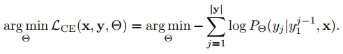

現今 NMT 訓練皆使用 `backpropogation` 及 `gradient-based optimizers` (e.g., Adam) 搭配 `cross-entropy loss`

架構如 `transformer`, `ConvS2S`, `RNN` 搭配 `LSTM`, `GRU` 來防止一些訓練問題，例如 `vanishing gradients`

但有實驗證明，這些 optimizer 仍然不能充分引出 NMT system 的潜力，經常會卡在 suboptima (local optima)

1. 實驗中一樣架構、訓練資料、參數的 NMT model，結果卻差異到 1 BLEU 之多
   * `Neural machine translation of rare words with subword units`
2. 各種實驗都發現將多個模型進行 ensembling 後效果變很好，這可能代表只用單個模型獲得成效是有困難的

所以 training 還是一個熱門且多樣的主題! 這個篇章主要針對 training 相關的方法做介紹

# Cross-entropy Training

首先了解一下什麼是 `cross-entropy`

* [Cross Entropy - Udacity](https://www.youtube.com/watch?v=tRsSi_sqXjI)
* [何謂 Cross-Entropy (交叉熵)](https://medium.com/@r23456999/%E4%BD%95%E8%AC%82-cross-entropy-%E4%BA%A4%E5%8F%89%E7%86%B5-b6d4cef9189d)
* [機器/深度學習: 基礎介紹-損失函數(loss function)](https://medium.com/@chih.sheng.huang821/%E6%A9%9F%E5%99%A8-%E6%B7%B1%E5%BA%A6%E5%AD%B8%E7%BF%92-%E5%9F%BA%E7%A4%8E%E4%BB%8B%E7%B4%B9-%E6%90%8D%E5%A4%B1%E5%87%BD%E6%95%B8-loss-function-2dcac5ebb6cb)

NMT training 的 `loss function` 通常都是使用 `cross-entropy loss`，在給定 (x, y) 訓練句子，要求出最佳化的 model parameters  可以表達成以下式子:

在實作中，會將多個 training pairs 包成 batches，然後求出每個 batch 的 loss 平均

我們可以用很多方式來表達 `loss function`，這些方式做法雖然不同，但意思相同:

1. Maximizing the likelihood of the training data.
2. Minimizing an estimate of the cross-entropy to the real `sequence-level` distribution
3. Minimizing an estimate of the cross-entropy to the real `token-level` distribution
4. Minimizing the cross-entropy to the `Dirac distribution`

> In particular, **we emphasize the equivalence between the sequence-level and the token-level estimation** since cross-entropy loss is often characterized as **token-level objective** in the literature whereas the term **sequence-level training** somewhat misleadingly usually refers to risk-based training under BLEU

# Training Deep Architectures

首先了解一下什麼是 `residual training` 及 `ResNet`

* [(深度學習)ResNet之殘差學習](https://medium.com/@hupinwei/%E6%B7%B1%E5%BA%A6%E5%AD%B8%E7%BF%92-resnet%E4%B9%8B%E6%AE%98%E5%B7%AE%E5%AD%B8%E7%BF%92-f3ac36701b2f)
* [深度學習甜點系列：愈堆愈高的 ResNet](https://ithelp.ithome.com.tw/articles/10204727)

越深的網路被證實比傳統的淺層網路 (shallow neural network) 要好，但深層的網路容易出現 `overfitting`, `vanishing gradient` 甚至是 `degradation` 的問題，解決辦法通常為:

1. Regularization
2. Dropout
3. **Residual connections**
4. **Batch Normalization**
5. **Layer Normalization**

`Batch normalization` 是用來解決 `vanishing gradient` 的主要方法之一，他的進階版是 `layer normalization`，廣泛用於 deep NLP models 例如 `transformer`

要了解 batch normalization 先了解 `mini-batch gradient descent`

* [優化演算(1): mini-batch gradient descent](https://medium.com/%E5%AD%B8%E4%BB%A5%E5%BB%A3%E6%89%8D/%E5%84%AA%E5%8C%96%E6%BC%94%E7%AE%97-5a4213d08943)

再來就是 batch normalization:

* [Optimization：優化深度學習模型的技巧（下）－ Batch Normalization](https://ithelp.ithome.com.tw/articles/10204106)
* [什么是 Batch Normalization 批标准化 (深度学习 deep learning)](https://www.youtube.com/watch?v=-5hESl-Lj-4)
* [Batch Normalization (“batch norm”) explained](https://www.youtube.com/watch?v=dXB-KQYkzNU)

最後是 layer normalization:

* [【AI数学】Layer-Normalization详细解析](https://blog.csdn.net/leviopku/article/details/83182194)

# Regularization

近期的 NMT 皆有大量參數 (over-parameterized) 的趨勢來幫助訓練，例如一個 `subword-level Transformer` 就可以有 200-300 million 的參數，過多的參數可能造成 `over-fitting`

最簡單解決 `over-fitting` 的方法就是 `regularizers`，常見的有 `L1` 和 `L2 regularization`，訂一些懲罰讓 outliers 的權重變為 0 並限制他們的重要性

而 NMT 也有三大 regularization 的技巧，分別是 `early stopping`, `dropout` 和 `label smoothing`

1. `Early stopping` 在 validation 變差時就結束訓練，避免繼續訓練造成 overfitting
2. `Dropout` 讓一些 neurons 機率性停機，讓整個網路的 weights 都有較好的訓練成效

而 label smoothing 則是從 label 下手，對 `one-hot encoding` 的 label 進行 "軟化" 的動作，讓 `one-hot encoding` 變得較為平滑，可以減緩 `over-fitting` 的問題，詳細的作法參考: 

* [深度学习 | 训练网络trick——label smoothing](https://blog.csdn.net/qiu931110/article/details/86684241)
* [label smoothing 如何让正确类与错误类在 logit 维度拉远的？](https://zhuanlan.zhihu.com/p/73054583)

其他用來 "smooth" output distribution 的方法還有:

1. Explicit entropy penalization
2. Knowledge distillation ([13. model-size](../13.%20model-size/README.md))
3. Subword regularization
4. SwitchOut
5. Noisy back-translation

# Large Batch Training

隨著 GPU 能力的提升，容量提升與平行化讓 `large batch training` 的效能線性的提升，而 `large batches` 往往比 `small batches` 能夠有更好的 `gradient estimation`

在 `Don’t decay the learning rate, increase the batch size` 就提到增加 `batch size` 能取得和 `learning rate decay` 類似的功效，想知道更多 `large batch training` 的討論請參考: `An empirical model of large-batch training`

在 GPU 效能還沒有很強的時候，無法將 `large batch data` 裝入 GPU memory，所以在 `Multi-representation ensembles and delayed SGD updates improve syntax-based NMT` 提出了 `delayed SGD` 能夠解決 `batch size` 和 GPU 的問題

# Reinforcement Learning

MLE training 有一些問題:

1. NMT training 跟 decoding 之間有 `exposure bias`
   1. 解決方法可以在訓練初期使用真實的 label，然後漸進式換成產生出來的 target tokens
2. `Training loss function` 和 `evalution metric` 的不匹配
   1. 在訓練時用的是 word-level cross-entropy
   2. 在測試時用的是 sentence- 或 document-level 的 BLEU

> * 什麼是 exposure bias? (需要先有 teacher forcing 和 autoregressive 的知識)
>   * [Seq2Seq中Exposure Bias现象的浅析与对策](https://kexue.fm/archives/7259)
> * 什麼是 teacher forcing?
>   * [Teacher Forcing策略在RNN的应用](https://blog.csdn.net/wl1710582732/article/details/88636852)
> * 什麼是 autoregressive?
>   * [Autoregressive model](https://en.wikipedia.org/wiki/Autoregressive_model)
> * 什麼是 non-autoregressive?
>   * [Improving Autoregressive NMT with Non-Autoregressive Model](https://www.aclweb.org/anthology/2020.autosimtrans-1.4/)

這些問題可透過 `reinforcement learning` 改善，以下簡單介紹 `reinforcement learning`:

1. `Agent` 會透過選擇 `action` 來和 `environment` 互動
2. 其中是透過 `policy` 選擇 `action`
3. 目標是學習到一個最好的 `policy` 來獲得最多的 `reward`

用 NMT 的視角來看 `reinforcement learning` 的話:

1. `agent` = `NMT model` 
2. `environment` = source sentence  + translation history 
3. `action` = choose next word
4. `policy` = 

用 `reinforcement learning` 訓練的 NMT 有一個好處，就是 reward **不需要滿足可微分**，也就是能使用 `BLEU` 或 `GLEU` 等 metrics，但這會讓 training 非常昂貴，所以通常還是使用 `cross-entropy loss`

雖然 `reinforcement learning` 在其他領域取得巨大成就，但目前還是無法在 MT 方法突破一些 baseline (e.g., SOTA NMT architecture, back-translation)

`Google’s neural machine translation system: Bridging the gap between human and machine translation` 就指出他們採用 `BLEU` 做為 reward 的 `reinforcement learning` 無法取得好的成果

# Dual Supervised Learning

我們都知道 NMT 就是在給予 source sentence `x` 和 target sentence `y` 然後訓練模型學會  的分布，但這只考慮到了單個方向 (source to target)

根據 chain rule 可以得到:

通常上面的  和  在 trained independently 情況下是不成立的，而 dual Supervised Learning 會利用 `dual supervised learning loss`  來讓兩者有所關聯:

另一種方法是使用 agreement-based approach: `Agreement-based joint training for bidirectional attention-based neural machine translation`

# Adversarial Training

Generative adversarial networks (GANs) 在電腦視覺非常熱門，先了解一下什麼是 GANs

* [何謂 Generative adversarial Networks(GANS) 生成式對抗網路?](https://medium.com/@r23456999/%E4%BD%95%E8%AC%82-generative-adversarial-networks-gans-%E7%94%9F%E6%88%90%E5%BC%8F%E5%B0%8D%E6%8A%97%E7%B6%B2%E8%B7%AF-4500a06dd0be)
* [什么是 GAN 生成对抗网络 (深度学习)?](https://www.youtube.com/watch?v=yYUN_k36u5Q)
* [GAN (Quick Review)](https://www.youtube.com/watch?v=ufcKFjdpT98)

1. Generator 會使用一堆 noise 來創造跟 real data 相似的東西
2. Discriminator 會像一般的 CNN 模型來分類是 generator 創造的東西或是 real data 內的東西
3. Discriminator 會將所學的東西告訴 generator
4. Generator 的 loss 來自 discriminator，而 discriminator 的 loss 就是一般分類的 loss
5. Generator 訓練時會凍結 discriminator，而 discriminator 訓練時會凍結 generator

以上最常見的做法是在 G, D 都使用 CNN 的 `deep convolutional generative adversarial networks` (DCGAN)

但這個做法中 generator 所產生的東西都是隨機的，我們可以給 G, D 都加入 condition 來指導他產生出更有意義的東西，例如一個依賴文字敘述來產生圖片的 CGAN 模型，可以給他沒看過的文字並生成圖片

* [Conditional Generative Adversarial Nets（cGAN 条件GAN）](https://blog.csdn.net/Teeyohuang/article/details/82391251)

在電腦視覺任務中，因為可以對生成圖片的梯度進行 back-propogation 因此能同時訓練 G, D，但在 NLP 卻不行，因為文字通常為一堆離散符號，所以大多只能使用 `reinforcement learning` 來生成文字的樣本或直接對 generator 的 `hidden activations` 做處理

目前 `adversarial training` 用於 NLP 的做法還非常少!
